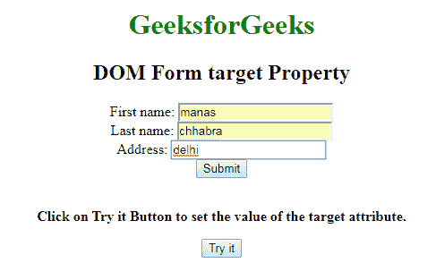
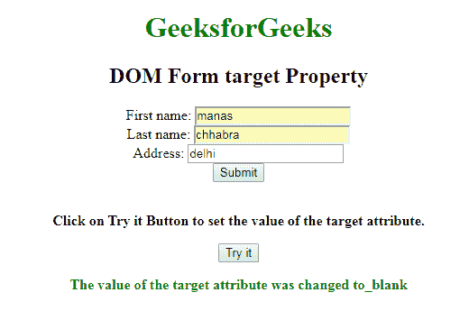
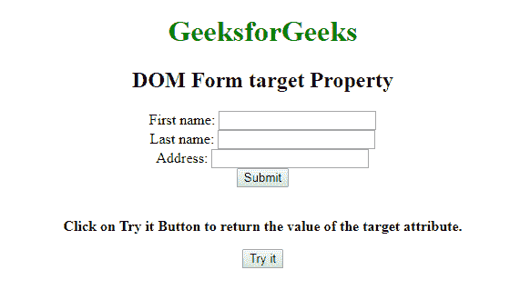
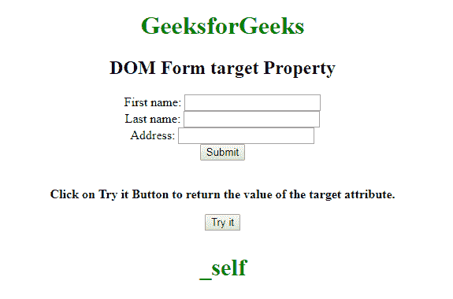

# HTML | DOM 表单目标属性

> 原文:[https://www . geesforgeks . org/html-DOM-form-target-property/](https://www.geeksforgeeks.org/html-dom-form-target-property/)

**DOM 表单目标**属性用于**设置**或**返回**表单目标属性的值。目标属性用于指定提交的结果是否会在**当前窗口**、**新标签**或新框架上的**中打开。**

**语法:**

*   它用于返回目标属性。

    ```html
    formObject.target
    ```

*   It is used to set the target property.

    ```html
    formObject.target = "_blank|_self|_parent|_top|framename"
    ```

    **属性值**

    *   **_blank:** 定义提交的结果将在新窗口或新标签中打开。
    *   **_self:** 指定提交的结果将在同一窗口中打开。
    *   **_parent:** 指定结果将在父框架集中打开。
    *   **_top:** 它指定结果将在窗口的整个主体中打开。
    *   **框架名称:**在命名框架中打开。

    **返回值:**返回一个字符串值，表示提交的结果是在*当前窗口、新标签还是在新框架*上打开。

    **示例-1:** 演示如何设置属性的 HTML 程序。

    ```html
    <!DOCTYPE html>
    <html>

    <head>
        <title>DOM Form target Property</title>
        <style>
            h1 {
                color: green;
            }

            body {
                text-align: center;
            }
        </style>
    </head>

    <body>
        <h1>GeeksforGeeks</h1>
        <h2>DOM Form target Property</h2>
        <form action="#" id="GFG" target="_self">
            First name:
            <input type="text" name="fname">
            <br> Last name:
            <input type="text" name="lname">
            <br> Address:
            <input type="text" name="Address">
            <br>
            <input type="submit" value="Submit">
        </form>
        <BR>
        <b><p>Click on Try it Button to set the
          value of the target attribute.</p>     

            <button onclick="Geeks()">Try it</button>
            <p id="sudo" 
               style="color:green;fonnt-size:20px;">
          </p>

            <script>
                function Geeks()  {
              // Set _blank property.
            var x = document.getElementById(
              "GFG").target = "_blank";
           document.getElementById("sudo").innerHTML = 
             "The value of the target attribute was changed to" 
           + x;
                }
            </script>
        </body>
    </html>
    ```

    **输出:**

    **点击按钮前:**
    

    **点击按钮后:**
    

    **示例-2:** 说明如何返回属性的 HTML 程序。

    ```html
    <!DOCTYPE html>
    <html>

    <head>
        <title>DOM Form target Property</title>
        <style>
            h1 {
                color: green;
            }

            body {
                text-align: center;
            }
        </style>
    </head>

    <body>
        <h1>GeeksforGeeks</h1>
        <h2>DOM Form target Property</h2>
        <form action="#" 
              id="GFG" 
              target="_self">
            First name:

            <input type="text" 
                   name="fname">
            <br> Last name:

            <input type="text" 
                   name="lname">
            <br> Address:

            <input type="text" 
                   name="Address">
            <br>

            <input type="submit" 
                   value="Submit">
        </form>
        <BR>

      <b><p>Click on Try it Button to return 
        the value of the target attribute.</p></b>

            <button onclick="Geeks()">Try it</button>
            <p id="sudo" style="color:green;font-size:30px;">
      </p>
            <script>
                function Geeks()  {

                // Return form target property.
            var x = document.getElementById("GFG").target;
           document.getElementById("sudo").innerHTML = x;
                }
            </script>
        </body> 
    </html>
    ```

    **输出:**

    **点击按钮前:**
    

    **点击按钮后:**
    

    **支持的浏览器:**

    *   谷歌 Chrome
    *   Mozilla Firefox
    *   边缘
    *   旅行队
    *   歌剧