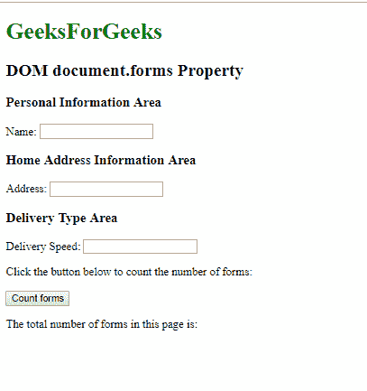
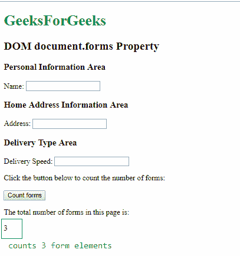
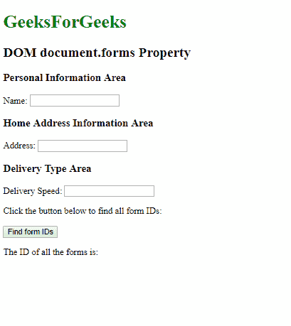
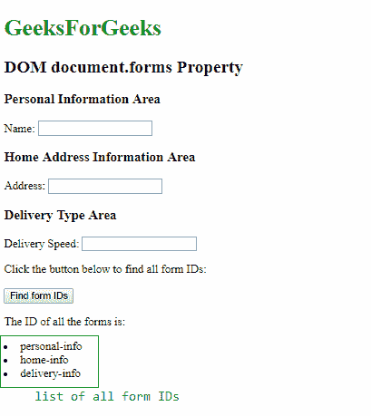
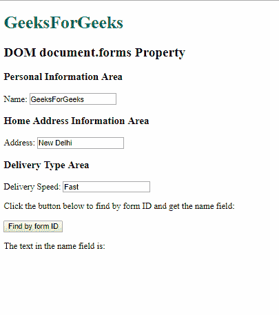
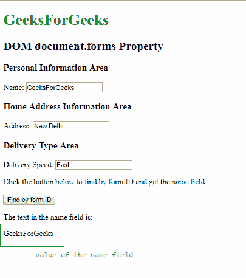

# HTML | DOM 表单集合

> 原文:[https://www.geeksforgeeks.org/html-dom-forms-collection/](https://www.geeksforgeeks.org/html-dom-forms-collection/)

**DOM 表单集合**用于返回一个 HTML 文档中所有<表单>元素的集合。表单元素在源代码中出现时进行排序。

**语法:**

```html
document.forms
```

**属性:**:返回元素集合中表单的个数。

**方法:**DOM 表单集合包含以下三种方法:

*   **【索引】**:用于返回指定索引的<表单>元素。索引值从 0 开始。如果索引值超出范围，则返回空值。
*   **项(索引)**:用于返回指定索引的<表单>元素。索引值从 0 开始。如果索引值超出范围，则返回空值。此方法的执行类似于上述方法。
*   **name item(id)**:用于从集合中返回与指定 id 匹配的<表单>元素。如果 id 不存在，则返回空值。

下面的程序说明了文档.表单属性在 HTML 中的使用:

**示例 1:** 本示例使用 length 属性计算集合中表单元素的数量。

```html
<!DOCTYPE html>
<html>
    <head>
        <title>
            DOM document.forms() Property
        </title>
    </head>

    <body>
        <h1 style = "color:green">GeeksForGeeks</h1>
        <h2>DOM document.forms Property</h2>

        <!-- form 1 starts from here -->
        <form id="personal-info">
            <h3>Personal Information Area</h3>
            Name: <input type="text">
        </form>
        <!-- form 1 ends here -->

        <!-- form 2 starts from here -->
        <form id="home-info">
            <h3>Home Address Information Area</h3>
            Address: <input type="text">
        </form>
        <!-- form 2 ends here -->

        <!-- form 3 starts from here -->
        <form id="delivery-info">
            <h3>Delivery Type Area</h3>
            Delivery Speed: <input type="text">
        </form>
        <!-- form 3 ends here -->

        <p>
         Click the button below to count 
         the number of forms:
        </p>

        <button onclick = "countForms()">
         Count forms
        </button>

        <p>
         The total number of forms in
         this page is: 
        </p>

        <div class = "count"></div>

        <script>
            function countForms() {

                // Count number of forms
                let collection = document.forms.length;
                document.querySelector(".count").innerHTML
                                          = collection;
            } 
        </script>
    </body>
</html>                    
```

**输出:**
**点击按钮前:**

**点击按钮后:**


**例 2:**

```html
<!DOCTYPE html>
<html>
    <head>
        <title>
            DOM document.forms() Property
        </title>
    </head>

    <body>
        <h1 style="color:green">GeeksForGeeks</h1>
        <h2>DOM document.forms Property</h2>

        <!-- form 1 starts from here -->
        <form id = "personal-info">
            <h3>Personal Information Area</h3>
            Name: <input type="text">
        </form>
        <!-- form 1 ends here -->

        <!-- form 2 starts from here -->
        <form id="home-info">
            <h3>Home Address Information Area</h3>
            Address: <input type="text">
        </form>
        <!-- form 2 ends here -->

        <!-- form 3 starts from here -->
        <form id="delivery-info">
            <h3>Delivery Type Area</h3>
            Delivery Speed: <input type="text">
        </form>
        <!-- form 3 ends here -->

        <p>
         Click the button below to find 
         all form IDs:
        </p>
        <button onclick="findFormIDs()">
         Find form IDs
        </button>

        <p>The ID of all the forms is: </p>

        <div class = "ids"></div>

        <script> 
            function findFormIDs() {
                let final = '';
                let collection = document.forms;

                // Run a loop upto the number of
                // forms in the collection
                for (let i = 0; i < collection.length; i++) {

                    // Add each form id to the final list
                    final += `<li> ${collection[i].id} </li>`;
                }

                // Replace the inner HTML of the 
                // ID div to show the list
                document.querySelector(".ids").innerHTML = final;
            } 
        </script>
    </body>
</html>                    
```

**输出:**
**点击按钮前:**

**点击按钮后:**


**例 3:**

```html
<!DOCTYPE html>
<html>
<head>
    <title>DOM document.forms() Property</title>
</head>

<body>
    <h1 style="color:green">GeeksForGeeks</h1>
    <h2>DOM document.forms Property</h2>

    <form id="personal-info">
        <h3>Personal Information Area</h3>
        Name: <input type="text">
    </form>
    <form id="home-info">
        <h3>Home Address Information Area</h3>
        Address: <input type="text">
    </form>
    <form id="delivery-info">
        <h3>Delivery Type Area</h3>
        Delivery Speed: <input type="text">
    </form>

    <p>
     Click the button below to find by form
     ID and get the name field:
    </p>
    <button onclick="returnForm()">
     Find by form ID
    </button>
    <p>The text in the name field is: </p>
    <div class="name"></div>
    <script>
        function returnForm() {
            // find by id of 'personal-info'
            let collection = 
                     document.forms.namedItem("personal-info");

            // access the first element in the 
            //collection and find its value
            // in this case it would be the name field
            let name = collection[0].value;

            document.querySelector(".name").innerHTML = name;

        }
    </script>
</body>
</html>                    
```

**输出:**
**点击按钮前:**

**点击按钮后:**


**支持的浏览器:**T2 DOM 表单集合方法支持的浏览器如下:

*   谷歌 Chrome
*   微软公司出品的 web 浏览器
*   火狐浏览器
*   旅行队
*   歌剧