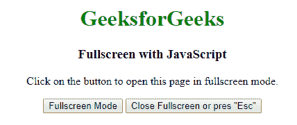

# html | DOM full screen change event

> 哎哎哎:# t0]https://www . geeksforgeeks . org/html-DOM-full screen change 事件/

当用户以全屏模式查看元素时，会发生 fullscreenchange 事件。element.requestFullscreen()方法用于以全屏模式查看元素，element.exitFullscreen()方法用于取消全屏模式。

**支持的标签**

*   **支持所有 HTML 元素。**

**语法:**

*   **在 HTML 中:**

```html
<element onfullscreenchange="myScript">
```

*   **在 JavaScript 中:**

```html
object.onfullscreenchange = function(){myScript};
```

*   **在 JavaScript 中，使用 addEventListener()方法:**

```html
object.addEventListener("fullscreenchange", myScript);
```

以下示例说明了 HTML DOM 中的全屏更改事件:

*   **示例 1:** 这个示例说明了 HTML DOM fullscreenchange 事件。

## 超文本标记语言

```html
<!DOCTYPE html>
<html>

<head>
    <meta name="viewport"
    content="width=device-width, initial-scale=1">
</head>

<body onfullscreenchange="function()">
    <center>
    <h1 id="geeks" style="color:green;">
                                GeeksforGeeks</h1>
    <h3>Fullscreen with JavaScript</h3>

<p>Click on the button to open this
                      page in fullscreen mode.</p>

    <button onclick="openFullscreen();">
                          Fullscreen Mode</button>
    <button onclick="closeFullscreen();">
           Close Fullscreen or pres "Esc"</button>

    <script>
        var gfg = document.documentElement;
        function openFullscreen() {
            if (gfg.requestFullscreen) {
                gfg.requestFullscreen();
            }
        }
        function closeFullscreen() {
            if (document.exitFullscreen) {
                document.exitFullscreen();
            }
        }

    </script>
</body>

</html>                   
```

*   **输出:**



*   **示例 2:** 本示例使用 JavaScript 处理 fullscreenchange 事件。

## 超文本标记语言

```html
<!DOCTYPE html>
<html>

<head>
    <meta name="viewport"
    content="width=device-width, initial-scale=1">
</head>

<body>
    <center>
    <h1 id="geeks" style="color:green;">
                                GeeksforGeeks</h1>
    <h3>Fullscreen with JavaScript</h3>

<p>Click on the button to open this
                      page in fullscreen mode.</p>

    <button onclick="openFullscreen();">
                          Fullscreen Mode</button>
    <button onclick="closeFullscreen();">
           Close Fullscreen or pres "Esc"</button>

    <script>
        var gfg = document.documentElement;
        function openFullscreen() {
            if (gfg.requestFullscreen) {
                gfg.requestFullscreen();
            }
        }
        function closeFullscreen() {
            if (document.exitFullscreen) {
                document.exitFullscreen();
            }
        }
        var output = document.getElementById("geeks");
        document.onfullscreenchange (function() {
        });
    </script>
</body>

</html>                   
```

*   **输出:**


*   **示例 3:** 本示例对 fullscreenchange 事件使用 addEventListener()方法。

## 超文本标记语言

```html
<!DOCTYPE html>
<html>

<head>
    <meta name="viewport"
    content="width=device-width, initial-scale=1">
</head>

<body>
    <center>
    <h1 id="geeks" style="color:green;">
                               GeeksforGeeks</h1>
    <h3>Fullscreen with JavaScript</h3>

<p>Click on the button to open this
                     page in fullscreen mode.</p>

    <button onclick="openFullscreen();">
                         Fullscreen Mode</button>
    <button onclick="closeFullscreen();">
          Close Fullscreen or pres "Esc"</button>

    <script>
        var gfg = document.documentElement;
        function openFullscreen() {
            if (gfg.requestFullscreen) {
                gfg.requestFullscreen();
            }
        }
        function closeFullscreen() {
            if (document.exitFullscreen) {
                document.exitFullscreen();
            }
        }
        var output = document.getElementById("geeks");
        document.addEventListener("fullscreenchange", function() {
            output.innerHTML = "A computer science portal for geeks";
        });
    </script>
</body>

</html>                   
```

*   **输出:**


*   谷歌 Chrome 45.0
*   Internet Explorer 11.0
*   Firefox 47.0
*   苹果 Safari 5.1
*   Opera 15.0