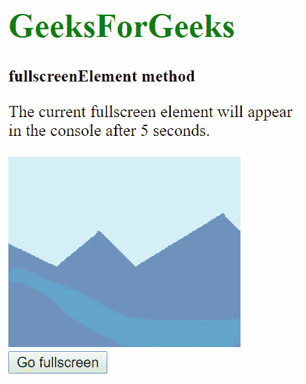

# HTML | DOM 全屏元素属性

> 原文:[https://www . geesforgeks . org/html-DOM-full screenelement-property/](https://www.geeksforgeeks.org/html-dom-fullscreenelement-property/)

HTML 中的**全屏元素**属性用于返回当前全屏的元素。此属性可能需要特定的前缀才能用于不同的浏览器。

**语法:**

```html
document.fullscreenElement
```

**返回值:**返回当前处于全屏模式的元素，如果全屏模式不可用，**为空**。

**示例:**

```html
<!DOCTYPE html>
<html>

<head>
    <title>fullscreenElement method</title>
</head>

<body>
    <h1 style="color: green">GeeksForGeeks</h1>
    <p><b>fullscreenElement method</b></p>
    <p>The current fullscreen element will 
       appear in the console after 5 seconds.</p>

    
    <br>
    <button onclick="goFullScreen();">Go fullscreen</button>
    <script>

        /* Log the element currently in fullscreen */
        function checkFullscreenElement() {
            console.log(
                /* Standard syntax */
                document.fullscreenElement ||

                /* Chrome, Safari and Opera syntax */
                document.webkitFullscreenElement ||

                /* Firefox syntax */
                document.mozFullScreenElement ||

                /* IE/Edge syntax */
                document.msFullscreenElement
            )
        }

        /* Call this function after 5 seconds,
        as we cannot click any button to execute 
        this function while in fullscreen */
        setTimeout(checkFullscreenElement, 5000);

        /* Go fullscreen */
        function goFullScreen() {
            if (
                /* Standard syntax */
                document.fullscreenEnabled ||

                /* Chrome, Safari and Opera syntax */
                document.webkitFullscreenEnabled ||

                /* Firefox syntax */
                document.mozFullScreenEnabled ||

                /* IE/Edge syntax */
                document.msFullscreenEnabled
            ) {
                elem = document.querySelector('#image');

                /* Try to go Fullscreen */
                elem.requestFullscreen();
            } else {
                console.log('Fullscreen is not available currently.')
            }
        }
    </script>
</body>

</html>
```

**输出:**



**控制台输出:**如果通过点击按钮激活全屏模式。


**控制台输出:**如果未激活全屏模式。


**支持的浏览器:**以下列出了 *fullscreenElement* 属性支持的浏览器:

*   谷歌 Chrome 45.0
*   Internet Explorer 11.0
*   Firefox 47.0
*   Opera 15.0
*   Safari 5.1