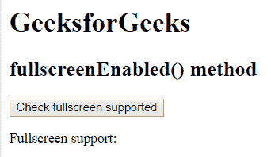
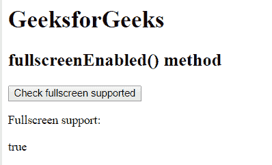
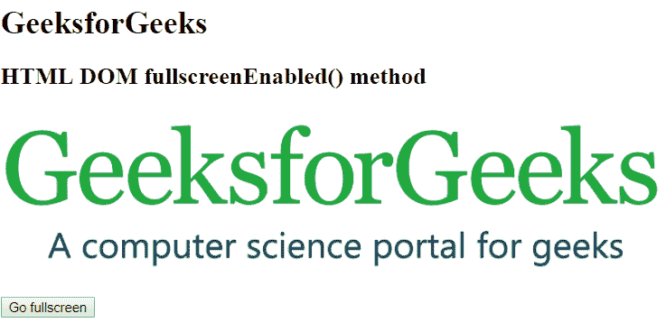

# HTML | DOM fullscreenEnabled()方法

> 原文:[https://www . geesforgeks . org/html-DOM-full screenenabled-method/](https://www.geeksforgeeks.org/html-dom-fullscreenenabled-method/)

HTML DOM 中的 fullscreenEnabled()方法用于检查文档是否可以全屏模式查看。它返回一个只读布尔值。此方法可能需要特定的前缀才能与不同的浏览器配合使用。

**语法:**

```html
document.fullscreenEnabled()
```

**参数:**此方法不接受任何参数。

**返回值:**返回布尔值:

*   **真:**如果可以全屏查看文档。
*   **False:** 如果无法在全屏模式下查看文档。

**例 1:**

```html
<!DOCTYPE html>
<html>
    <head>
        <title>
            HTML DOM fullscreenEnabled() method
        </title>

        <!-- script to check full screen enabled or not -->
        <script>
            function requestFullScreen() {
                let isFullscreenSupported =

                    /* Standard syntax */
                    (document.fullscreenEnabled || 

                    /* Chrome, Safari and Opera */
                    document.webkitFullscreenEnabled ||

                     /* Firefox */
                    document.mozFullScreenEnabled ||

                    /* IE/Edge */
                    document.msFullscreenEnabled);

                document.querySelector('.isSupported').innerHTML 
                        = isFullscreenSupported;
            }
        </script>
    </head>

    <body>
        <h1>
            GeeksforGeeks
        </h1>

        <h2>
            fullscreenEnabled() method
        </h2>

        <!-- script called here -->
        <button onclick="requestFullScreen();">
            Check fullscreen supported
        </button>

        <p>Fullscreen support:</p>

        <div class="isSupported"></div>

    </body>
</html>                                
```

**输出:**
**之前点击按钮:**

**之后点击按钮:**


**例 2:**

```html
<!DOCTYPE html>
<html>
    <head>
        <title>
            HTML DOM fullscreenEnabled() method
        </title>

        <!-- script to enable full screen -->
        <script>
            function goFullScreen() {
                if (

                    /* Standard syntax */
                    document.fullscreenEnabled || 

                    /* Chrome, Safari and Opera */
                    document.webkitFullscreenEnabled || 

                    /* Firefox */
                    document.mozFullScreenEnabled ||

                    /* IE/Edge */
                    document.msFullscreenEnabled 
                ) {
                    elem = document.querySelector('#image');
                    elem.requestFullscreen();
                }
                else {
                    console.log('Fullscreen not enabled')
                }
            }
        </script>
    </head>

    <body>
        <h1>GeeksforGeeks</h1>

        <h2>
            HTML DOM fullscreenEnabled() method
        </h2>

        
        <br>

        <button onclick = "goFullScreen();">
            Fullscreen
        </button>

    </body>
</html>                    
```

**输出:**
**之前点击按钮:**

**之后点击按钮:**


**支持的浏览器:**下面列出了 *fullscreenEnabled()* 方法支持的浏览器:

*   谷歌 Chrome 45.0-网络工具包-
*   火狐 47.0 -moz-
*   Internet Explorer 11.0 -ms-
*   Apple Safari 5.1 -webkit-
*   Opera 15.0 -webkit-