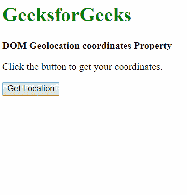
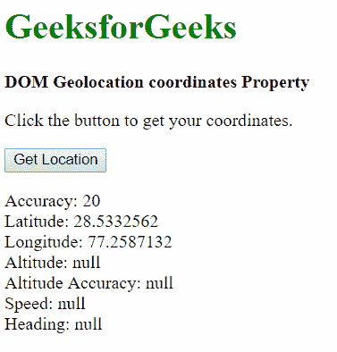

# HTML | DOM 地理位置坐标属性

> 原文:[https://www . geesforgeks . org/html-DOM-地理位置-坐标-属性/](https://www.geeksforgeeks.org/html-dom-geolocation-coordinates-property/)

HTML 中的 **DOM 地理位置坐标**属性用于返回设备在地球上的位置和高度。返回的坐标对象可以用于各种目的，包括导航和跟踪设备的位置。

**属性值:**

| 价值观念 | 描述 |
| 坐标。纬度 | 这是以十进制度表示的设备纬度。 |
| 坐标.经度 | 这是以十进制度表示的设备经度。 |
| 坐标精度 | 这是以米为单位返回的经纬度的精度。 |
| 坐标高度 | 这是设备相对于海平面的高度，单位为米。 |
| 坐标.高度精度 | 这是以米为单位返回的高度的精度。 |
| 坐标，航向 | 这是设备行进的方向。该值以度为单位，表示相对于正北的当前方向。该值可能为空。 |
| 坐标速度 | 这是设备的速度，单位是米每秒。如果设备没有运行，该值可能为空。 |

**用法:**像 **getCurrentPosition()** 或者 **watchPosition()** 这样的方法用来传递一个回调函数，然后访问坐标属性。

**示例:**

```html
<!DOCTYPE html>
<html>
<title>DOM Geolocation coordinates Property</title>

<body>  
  <h1 style="color: green">GeeksforGeeks</h1>

  <b>DOM Geolocation coordinates Property</b>

  <p>Click the button to get your coordinates.</p>

  <button onclick="getLocation()">Get Location</button>

  <p class="location"></p>

    <script>
        let x = document.querySelector('.location');

        function getLocation() {

            /* Check if location support is available */
            if (navigator.geolocation) {

                /* Callback to the showPosition function */
                navigator.geolocation.getCurrentPosition(
                  showPosition);
            } else {
                x.innerHTML = "Geolocation is not supported.";
            }
        }

        function showPosition(position) {

            /* Assign the Coordinates object to a variable */
            let coordinatesObject = position.coords;

            x.innerHTML =
                "Accuracy: " +

                /* Get the accuracy from the 
                Coordinates object */
                coordinatesObject.accuracy +

                "<br>Latitude: " +

                /* Get the latitude from the 
                Coordinates object */
                coordinatesObject.latitude +

                "<br>Longitude: " +

                /* Get the longitude from the 
                Coordinates object */
                coordinatesObject.longitude +

                "<br>Altitude: " +

                /* Get the altitude from the 
                Coordinates object */
                coordinatesObject.altitude +

                "<br>Altitude Accuracy: " +

                /* Get the altitude accuracy 
                from the Coordinates object */
                coordinatesObject.altitudeAccuracy +

                "<br>Speed: " +

                /* Get the speed from 
                the Coordinates object */
                coordinatesObject.speed +

                "<br>Heading: " +

                /* Get the heading from 
                the Coordinates object */
                coordinatesObject.heading;

        }
    </script>
</body>

</html>
```

**输出:**

**点击按钮前:**


**点击按钮后:**


**支持的浏览器:**T2 DOM 地理位置坐标属性支持的浏览器如下:

*   谷歌 Chrome 5.0
*   Firefox 3.5
*   Internet Explorer 9.0
*   歌剧 10.6
*   Safari 5.0