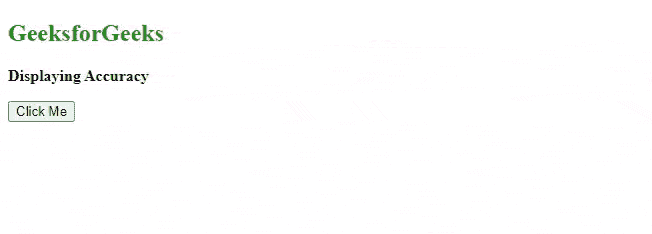

# HTML DOM 地理定位坐标精度属性

> 原文:[https://www . geesforgeks . org/html-DOM-地理位置-坐标-精度-属性/](https://www.geeksforgeeks.org/html-dom-geolocation-coords-accuracy-property/)

在本文中，我们将讨论[地理定位](https://www.geeksforgeeks.org/html-geolocation/) *精度*属性。HTML 中的地理定位用来获取用户的地理位置。这个地理定位中的 **getCurrentPosition()** 方法在成功时返回一个对象。

**HTML 地理定位** **坐标精度属性:**该属性将以十进制数的形式返回位置的精度

**语法**:

```html
coords.accuracy
```

**示例**:以下 HTML 程序返回精度。

## 超文本标记语言

```html
<!DOCTYPE html>
<html>
<body>
    <h2 style="color:green">
        GeeksforGeeks
    </h2>

    <p><b>Displaying Accuracy</b></p>

    <button onclick="getlocation()"> 
        Click Me 
    </button>

    <p id="paraID"></p>

    <script>
        var variable1 = document.getElementById("paraID");

        function getlocation() {
            navigator.geolocation.getCurrentPosition(showLoc);
        }

        function showLoc(pos) {
            variable1.innerHTML = "Accuracy: "
                + pos.coords.accuracy;
        }
    </script>
</body>

</html>
```

**输出:**

