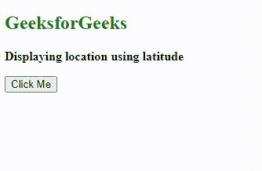

# HTML DOM 地理位置坐标纬度属性

> 原文:[https://www . geesforgeks . org/html-DOM-geolocation-coords-latitude-property/](https://www.geeksforgeeks.org/html-dom-geolocation-coords-latitude-property/)

在本文中，我们将讨论地理位置纬度属性。HTML 中的地理定位用来获取用户的地理位置。在这个地理定位中， **getCurrentPosition()** 方法在成功时返回一个对象。

**坐标纬度**:该属性将纬度作为十进制数返回。

有关其他位置属性的更多详细信息，请参考 [HTML 地理定位](https://www.geeksforgeeks.org/html-geolocation/)文章。

**语法**:

```html
coords.latitude
```

**返回值:-** 该属性以十进制数的形式返回纬度。

**示例**:下面的 HTML 代码将返回纬度。

## 超文本标记语言

```html
<!DOCTYPE html>
<html>

<head>
    <meta charset="utf-8">
    <meta name="viewport" content=
        "width=device-width,initial-scale=1">
</head>

<body>
    <h2 style="color:green">
        GeeksforGeeks
    </h2>

<p>
        <b>Displaying location using latitude</b>
    </p>

    <button onclick="getlocation()">
        Click Me
    </button>

    <p id="paraID"></p>

    <script>
        var variable1 = document.getElementById("paraID");

        function getlocation() {
            navigator.geolocation.getCurrentPosition(showLoc);
        }

        function showLoc(pos) {
            variable1.innerHTML = "Latitude: "
                + pos.coords.latitude;
        }
    </script>
</body>

</html>
```

**输出:**



**支持的浏览器:**

*   谷歌 Chrome
*   微软边缘
*   火狐浏览器
*   歌剧
*   旅行队