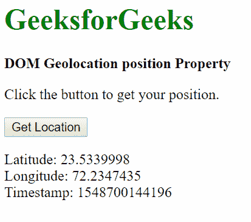

# HTML | DOM 地理定位位置属性

> 原文:[https://www . geesforgeks . org/html-DOM-geolocation-position-property/](https://www.geeksforgeeks.org/html-dom-geolocation-position-property/)

HTML DOM 中的**地理位置**属性用于返回设备在地球上的位置。返回的坐标对象可以用于各种目的，包括导航和跟踪设备的位置。

**返回值:**

*   **position.coords:** 拥有当前位置所有信息的坐标对象。
*   **position.timestamp:** 表示获取位置的时间的 DOMTimeStamp。

**用法:【getCurrentPosition()或 watchPosition()之类的方法用于向函数传递回调，然后访问 Position 属性。**

**示例:**

```html
<!DOCTYPE html>
<html>

<title>
    DOM Geolocation position Property
</title>

<body>
    <h1 style = "color: green">
        GeeksforGeeks
    </h1>

    <b>
        DOM Geolocation position Property
    </b>

    <p>
        Click the button to get your position.
    </p>

    <button onclick = "getLocation()">
        Get Location
    </button>

    <p class = "location"></p>

    <script>
        let x = document.querySelector('.location');

        function getLocation() {

            /* Check if location support is available */
            if (navigator.geolocation) {

                /* Callback to the showPosition function */
                navigator.geolocation.getCurrentPosition(showPosition);
            } else { 
                x.innerHTML = "Geolocation is not supported.";
            }
        }

        function showPosition(position) {
            x.innerHTML = "Latitude: " + 

            /* Get the latitude from the Coordinates object */
            position.coords.latitude + 

            "<br>Longitude: " + 

            /* Get the longitude from the Coordinates object */
            position.coords.longitude +

            "<br>Timestamp: " +

            /* Get the timestamp of the location obtained */
            position.timestamp;
        }
    </script>
</body>

</html>                    
```

**输出:**
**点击按钮前:**

**点击按钮后:**


**支持的浏览器:**T2 DOM 地理位置属性支持的浏览器如下:

*   谷歌 Chrome 5.0
*   Internet Explorer 9.0
*   Firefox 3.5
*   Opera 16.0
*   Safari 5.0