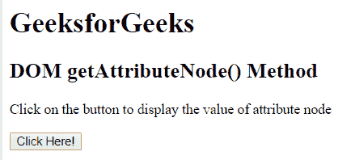
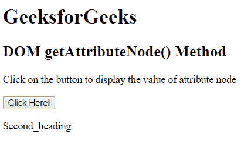

# HTML | DOM getAttributeNode()方法

> 原文:[https://www . geesforgeks . org/html-DOM-getattributenode-method/](https://www.geeksforgeeks.org/html-dom-getattributenode-method/)

HTML DOM 中的 **getAttributeNode()** 方法用于返回具有指定元素名称的属性节点，作为属性对象。该函数类似于 getAttribute()方法，但唯一的区别是 getAttribute()方法返回的是属性节点的值，而不是任何属性对象的值。

**语法:**

```html
element.getAttributeNode( attribute_name )
```

**参数:**该方法接受单参数*属性 _ 名称*，为必选项。此参数用于保存属性的名称。

**返回值:**该方法返回一个表示属性节点的属性对象。

**示例:**本示例包含两个标题元素，任务是显示第二个标题元素的属性节点的值。

```html
<!DOCTYPE html>
<html>
    <head>
        <title>
            HTML DOM getAttributeNode() Method
        </title>

        <!--script to display the value of
            class attribute -->
        <script>
            function Geeks() {
                var element_name =
                document.getElementsByTagName("H2")[0];

                var attribute = 
                element_name.getAttributeNode("class").value;

                document.getElementById("result").innerHTML
                        = attribute;
            }
        </script>
    </head>

    <body>
        <h1 class = "Frst_heading">
            GeeksforGeeks
        </h1>

        <h2 class = "Second_heading">
            DOM getAttributeNode() Method
        </h2>

        <p>
            Click on the button to display
            the value of attribute node
        </p>

        <button onclick = "Geeks()">
            Click Here!
        </button>

        <p id = "result"></p>

    </body>
</html>                    
```

**输出:**
**之前点击按钮:**

**之后点击按钮:**


**支持的浏览器:**下面列出了 *DOM getAttributeNode()* 方法支持的浏览器:

*   谷歌 Chrome
*   微软公司出品的 web 浏览器
*   火狐浏览器
*   歌剧
*   旅行队