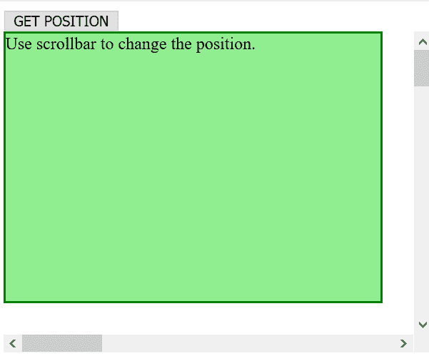

# HTML | DOM getBoundingClientRect()方法

> 原文:[https://www . geesforgeks . org/html-DOM-getboundingclientrect-method/](https://www.geeksforgeeks.org/html-dom-getboundingclientrect-method/)

**HTML DOM getBoundingClientRect()方法**返回相对视口的定位。
返回八个属性:左、上、右、下、x、y、宽、高。
滚动会改变位置值。

**语法:**

```html
var rect = div.getBoundingClientRect();
```

**示例:**

```html
<!DOCTYPE html>
<html>

<head>
    <title>
        HTML | DOM getBoundingClientRect() Method
    </title>
    <script>
        function myFunction() {
            var div = document.getElementById("myDiv");
            var rectangle = div.getBoundingClientRect();
            x = rectangle.left;
            y = rectangle.top;
            w = rectangle.width;
            h = rectangle.height;

            alert("Left:" + x + ", Top:" + y +
                ", Width:" + w + ", Height:" + h);
        }
    </script>
</head>

<body>
    <button onclick="myFunction()">
        GET POSITION
    </button>
    <div style="height:300px; 
                width:400px;
                overflow:auto;">

        <div id="myDiv" style="width:350px;
                               height:250px; 
                               background-color:lightgreen;
                               border:2px SOLID green;">

            Use scrollbar to change the position.
        </div>
        <div style="width:1500px;
                    height:1500px; ">
        </div>
    </div>
    <br>

</body>

</html>
```

**输出:**
**点击前:**


**点击后:**


**支持的浏览器:**

*   Chrome 1.0
*   Internet Explorer 9.0
*   FireFox 3.0
*   歌剧 9.5
*   Safari 4.0