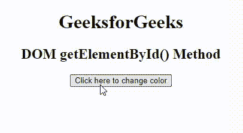
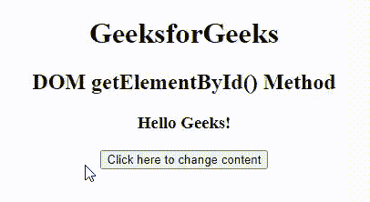

# HTML DOM getElementById()方法

> 原文:[https://www . geesforgeks . org/html-DOM-getelementbyid-method/](https://www.geeksforgeeks.org/html-dom-getelementbyid-method/)

**getElementById()** 方法返回给定了传递给函数的标识的元素。该函数是网页设计中广泛使用的 [HTML DOM](https://www.geeksforgeeks.org/dom-document-object-model/) 方法，用于改变任何特定元素的值或获取特定元素。如果传递给函数的标识不存在，则返回空值。该元素需要具有唯一的 *id* ，为了快速访问该特定元素，&以及该特定的 *id* 在整个文档中只能使用一次。

**语法:**

```html
document.getElementById( element_ID )
```

**参数:**该功能接受单参数*元素 _ID* ，用于保存元素的 ID。

**返回值:**返回给定 ID 的对象。如果不存在具有给定标识的元素，则返回空值。

**示例 1:** 本示例描述了 **getElementById()** 方法，其中 element_id 用于在单击按钮时更改文本的颜色。

## 超文本标记语言

```html
<!DOCTYPE html>
<html>

<head>
    <title>
        DOM getElementById() Method
    </title>

    <script>

        // Function to change the color of element
        function geeks() {
            var demo = document.getElementById("geeks");
            demo.style.color = "green";
        }
    </script>
</head>

<body style="text-align:center">
    <h1 id="geeks">GeeksforGeeks</h1>
    <h2>DOM getElementById() Method</h2>

    <!-- Click on the button to change color -->
    <input type="button" 
           onclick="geeks()" 
           value="Click here to change color" />
</body>

</html>
```

**输出:**



getElementById()方法

**示例 2:** 此示例描述了 **getElementById()** 方法，其中 element_id 用于在单击按钮时更改内容。

## 超文本标记语言

```html
<!DOCTYPE html>
<html>

<head>
    <title>
        DOM getElementById() Method
    </title>

    <script>

        // Function to change content of element
        function geeks() {
            var demo = document.getElementById("geeks");
            demo.innerHTML = "Welcome to GeeksforGeeks!";
        }
    </script>
</head>

<body style="text-align:center">
    <h1>GeeksforGeeks</h1>
    <h2>DOM getElementById() Method</h2>
    <h3 id="geeks">Hello Geeks!</h3>

    <!-- Click here to change content -->
    <input type="button" 
           onclick="geeks()" 
           value="Click here to change content" />
</body>

</html>
```

**输出:**



getElementById()方法

**支持的浏览器:**DOM getElementById()方法支持的浏览器如下:

*   谷歌 Chrome 1.0
*   Internet Explorer 5.5
*   微软边缘 12.0
*   Firefox 1.0
*   Opera 7.0
*   Safari 1.0