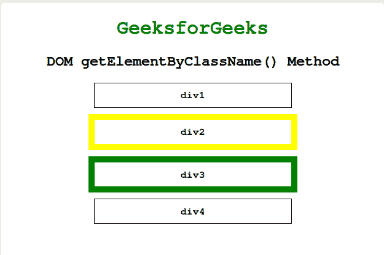
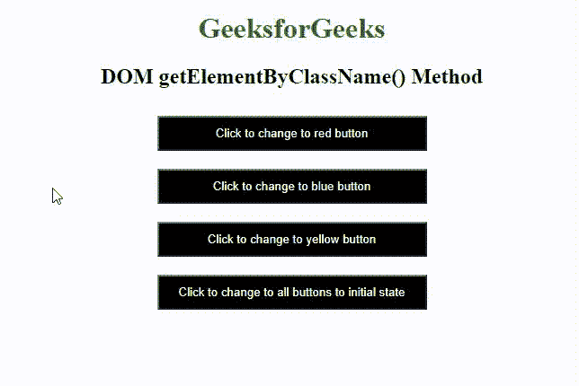

# html DOM getelementsbycclass name()方法

> 原文:[https://www . geesforgeks . org/html-DOM-getelementsbyclassname-method/](https://www.geeksforgeeks.org/html-dom-getelementsbyclassname-method/)

Javascript 中的 **getElementsByClassName()** 方法返回一个对象，该对象包含文档中具有指定类名的所有元素作为对象。返回的对象中的每个元素都可以通过其索引来访问。索引值将以 0 开始。可以对任何单个元素调用此方法来搜索具有指定类名的后代元素。

**语法:**

```html
document.getElementsByClassName(classnames);
```

**参数:**这是一个必需的方法，只需要一个参数，这个参数是一个字符串，包含要搜索的元素的以空格分隔的类名。对于使用多个类名的搜索，必须用空格分隔。

**注意:**我们可以使用 [length 属性](https://www.geeksforgeeks.org/htmlcollection-length-property/)返回指定类名&的文档中所有 HTML 元素的集合，然后通过遍历 HTML 元素，我们可以获取想要的信息。

**示例 1:** 本示例描述了 getElementsByClassName()方法，用于通过 HTML 元素的类名来访问该元素。

## 超文本标记语言

```html
<!DOCTYPE html>
<html>

<head>
    <title>DOM getElementByClassName() Method</title>
    <style>
    h1 {
        color: green;
    }

    body {
        text-align: center;
    }

    .example {
        padding: 10px;
        margin: auto;
        margin-top: 10px;
        border: 1px solid black;
        width: 300px;
    }
    </style>
</head>

<body>
    <h1>GeeksforGeeks</h1>
    <h2>DOM getElementByClassName() Method</h2>
    <div>
        <h4 class="example">div1</h4>
        <h4 class="yellowBorder example">div2</h4>
        <h4 class="greenBorder example">div3</h4>
        <h4 class="example">div4</h4> </div>
    <script>
    document.getElementsByClassName('greenBorder example')[0].style.border =
    "10px solid green";
    document.getElementsByClassName('yellowBorder example')[0].style.border =
    "10px solid yellow";
    </script>
</body>

</html>
```

**输出:**



document . getelementsbyclassname()方法

**示例 2:** 本示例描述了使用*document . getelementsbyclassname()*方法，该方法使用特定颜色访问所有 3 个按钮类&改变单击的按钮的颜色&最后一个按钮将上述 3 个按钮重置为其初始状态。

## 超文本标记语言

```html
<!DOCTYPE html>
<html>

<head>
    <title>DOM getElementByClassName() Method</title>
    <style>
    h1 {
        color: green;
    }

    body {
        text-align: center;
    }

    button {
        background-color: black;
        color: white;
        width: 300px;
        padding: 10px;
        margin: 10px;
        cursor: pointer;
    }
    </style>
</head>

<body>
    <h1>GeeksforGeeks</h1>
    <h2>DOM getElementByClassName() Method</h2>
    <div>
        <button onclick="red()" class="black red">
             Click to change to red button
        </button>
        <br>
        <button onclick="blue()" class="black blue">
             Click to change to blue button
        </button>
        <br>
        <button onclick="yellow()" class="black yellow">
             Click to change to yellow button
        </button>
        <br>
        <button onclick="black()">
             Click to change to all buttons to initial state
        </button>
    </div>
    <script>
    function red() {
        document.getElementsByClassName('red')[0]
        .style.backgroundColor = 'red';
    }

    function blue() {
        document.getElementsByClassName('blue')[0]
        .style.backgroundColor = 'blue';
    }

    function yellow() {
        document.getElementsByClassName('yellow')[0]
        .style.backgroundColor = 'yellow';
    }

    function black() {
        var elements = document.getElementsByClassName('black');
        for(var i = 0; i < elements.length; i++) {
            elements[i].style.backgroundColor = 'black';
        }
    }
    </script>
</body>

</html>
```

**输出:**



document . getelementsbyclassname()方法

**支持的浏览器:**下面列出了*DOM getElementsByClassName()*支持的浏览器:

*   谷歌 Chrome 4.0
*   Internet Explorer 9.0
*   微软边缘 12.0
*   Firefox 3.0
*   歌剧 9.5
*   Safari 3.1