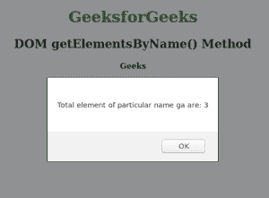
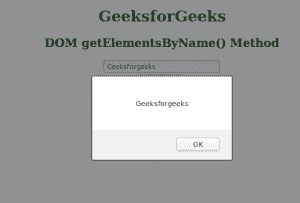

# HTML | DOM getElementsByName()方法

> 原文:[https://www . geesforgeks . org/html-DOM-getelementsbyname-method/](https://www.geeksforgeeks.org/html-dom-getelementsbyname-method/)

**getElementsByName()** 方法按名称返回特定文档所有元素的集合。这个集合称为节点列表，节点列表的每个元素都可以在索引的帮助下被访问。

**语法:**

```html
document.getElementsByName(name)

```

**参数:**该功能接受单据名称。

**返回类型:**这个函数返回元素的集合。

通过使用内置方法长度，我们可以找到该特定元素中存在的元素总数。下面的例子清楚地说明了这一点。

**注意:**不存在 getElementByName()方法，它是 getElementsByName()，带有一个' s '。
**例-1:**

```html
<!DOCTYPE html>
<html>

<head>
    <title>DOM getElementsByName()</title>
    <style>
        body {
            text-align: center;
        }

        h1 {
            color: green;
        }
    </style>
    <script>
        // creating geeks function to display 
        // number of elements at particular name 
        function geeks() {

            // taking list of elements under name ga
            var x = document.getElementsByName("ga");

          // printing number of elements inside alert tag
          alert("Total element with name ga are: " + x.length);
        }
    </script>
</head>

<body>
    <h1>GeeksforGeeks</h1>
    <h2>DOM getElementsByName() Method</h2>

    <!-- creating tag with name ga -->
    <h4 name="ga">Geeks</h4>
    <h4 name="ga">for</h4>
    <h4 name="ga">Geeks</h4>

    <input type="button" onclick="geeks()" 
                         value="Click here" />
</body>

</html>
```

**输出:**


由于 document.getElementsByName()方法返回一个包含对象的数组，如果我们想得到任何对象的值，那么我们应该使用 document . getelementsbyname(" element _ name ")[index]. value .否则我们将得到未定义的结果。下面的程序解释得很清楚。

```html
<!DOCTYPE html>
<html>

<head>
    <title>DOM getElementsByName()</title>
    <style>
        body {
            text-align: center;
        }

        h1 {
            color: green;
        }
    </style>
    <script>
        // creating geeks function to display
        // elements at particular name 
        function geeks() {

            // This line will print entered result
            alert(document.getElementsByName("ga")[0].value);

        }
    </script>
</head>

<body>
    <h1>GeeksforGeeks</h1>
    <h2>DOM getElementsByName() Method</h2>

    <!-- This will create an  input tag-->
    <input type="text" name="ga" />
    <br>
    <br>
    <!-- function will be called when we 
    click on this button-->
    <input type="button" onclick="geeks()" 
                         value="Click here" />
    <p></p>
</body>

</html>

```

**输出:**


**支持的浏览器:**DOM getElementsByName()方法支持的浏览器如下:

*   铬
*   微软公司出品的 web 浏览器
*   火狐浏览器
*   歌剧
*   旅行队