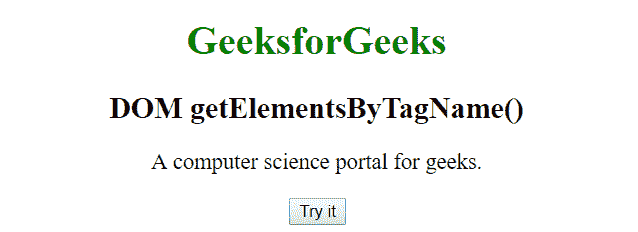
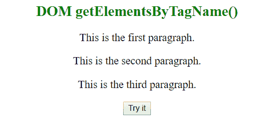

# HTML | DOM getElementsByTagName()方法

> 原文:[https://www . geesforgeks . org/html-DOM-getelementsbytagname-method/](https://www.geeksforgeeks.org/html-dom-getelementsbytagname-method/)

HTML 中的 **getElementsByTagName()** 方法返回给定标签名的文档中所有元素的集合。要提取任何信息，只需使用 length 属性遍历所有元素。

**语法:**

```html
var elements = document.getElementsByTagName(name);
```

其中:

*   **元素**是所有找到的元素的集合，它们以给定的标签名出现的顺序排列。
*   **名称**是表示元素名称的字符串。特殊字符串“*”代表所有元素。

**例 1:**

```html
<!DOCTYPE html>
<html>
    <head>
        <title>DOM getElementsByTagName() Method</title>
    </head>
    <body style = "text-align: center">
        <h1 style = "color: green;">
            GeeksforGeeks
        </h1>

        <h2 >
            DOM getElementsByTagName() 
        </h2>

        <p>A computer science portal for geeks.</p>

        <button onclick="geek()">Try it</button>
        <script>
        function geek() {
          var doc = document.getElementsByTagName("p");
          doc[0].style.background = "green";
          doc[0].style.color = "white";
        }
        </script>

    </body>
</html>
```

**输出:**
**点击按钮前:**

**点击按钮后:**


**例 2:**

```html
<!DOCTYPE html>
<html>
    <head>
        <title>DOM getElementsByTagName() Method</title>
    </head>
    <body style = "text-align: center">

        <h2 style = "color: green;">
            DOM getElementsByTagName() 
        </h2>

        <p>This is the first paragraph.</p>

        <p>This is the second paragraph.</p>

        <p>This is the third paragraph.</p>

        <button onclick="geek()">Try it</button>

        <script>
        function geek() {
          var doc = document.getElementsByTagName("P");
          var i;
          for (i = 0; i < doc.length; i++) {
            doc[i].style.backgroundColor = "green";
            doc[i].style.color = "white";
          }
        }
        </script>

    </body>
</html>
```

**输出:**
**点击按钮前:**

**点击按钮后:**


**支持的浏览器:**下面列出了 *getElementsByTagName()* 方法支持的浏览器:

*   谷歌 Chrome 1.0
*   Internet Explorer 6.0
*   Firefox 3.0
*   歌剧 9.5
*   Safari 3.0