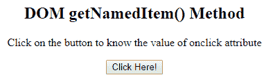

# HTML | DOM getNamedItem()方法

> 原文:[https://www.geeksforgeeks.org/html-dom-getnameditem-method/](https://www.geeksforgeeks.org/html-dom-getnameditem-method/)

HTML 中的 DOM **getNamedItem()** 方法用于从 NamedNodeMap 对象返回属性节点。
**语法:**

```html
namednodemap.getNamedItem( nodename )
```

**参数的值:**该方法包含单个参数*节点名*，为必选项。nodename 是从 NamedNodeMap 对象返回的。
**返回值:**返回一个 *<u>节点对象，</u>* ，代表指定名称的属性节点

**示例:**

## 超文本标记语言

```html
<!DOCTYPE html>
<html>
    <head>
        <title>
            DOM getNamedItem() Method
        </title>

        <script>
            /* main function */
            function MyGeeks() {
                var ele = document.getElementsByTagName("button")[0];
                var item = ele.attributes.getNamedItem("onclick").value;
                document.getElementById("geeks").innerHTML = item;
            }
        </script>
    </head>

    <body style = "text-align:center">

        <h2>DOM getNamedItem() Method</h2>

<p>
            Click on the button to know the
            value of onclick attribute
        </p>

        <button onclick = "MyGeeks()">
            Click Here!
        </button>

        <p id="geeks"></p>

    </body>
</html>                   
```

**输出:**
**之前点击按钮:**



**点击按钮后:**


**支持的浏览器:**T2 DOM getNamedItem()方法支持的浏览器如下:

*   谷歌 Chrome
*   Internet Explorer 9.0
*   火狐浏览器
*   歌剧
*   旅行队