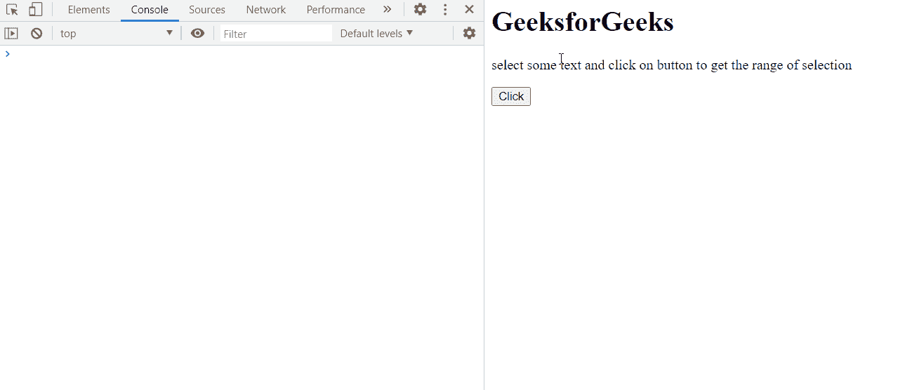

# HTML DOM getRangeAt()方法

> 原文:[https://www.geeksforgeeks.org/html-dom-getrangeat-method/](https://www.geeksforgeeks.org/html-dom-getrangeat-method/)

**getRangeAt()** 方法从所选文本中返回包含**开始偏移**索引和**结束偏移**索引的**范围对象**。

**语法:**

```html
range = selection.getRangeAt(index)

```

**参数:**

*   **索引:**从文档的**范围计数**开始的零基索引。

**返回值:**

*   返回包含所选文本的开始偏移量和结束偏移量索引的**范围对象**。

**示例:**

在这个例子中，我们将选择一些文本，并将获得所选文本的范围。

```html
<html>
   <head>
      <title>GeeksforGeeks</title>
      </head>
      <body>
          <h1>GeeksforGeeks</h1>
        <p>select some text and click on
      button to get the range of selection</p>
        <button onclick="range()">Click</button>
      </body>
        <script>
            function range(){
                 let ranges = [];
              sel = window.getSelection();
              for(let i = 0; i < sel.rangeCount; i++) {
               ranges[i] = sel.getRangeAt(i);
               console.log(ranges[i])
              }
              }
        </script>
</html>
```

**输出:**

在控制台中，可以看到范围对象:



**支持的浏览器:**

*   谷歌 Chrome
*   边缘
*   火狐浏览器
*   歌剧
*   旅行队