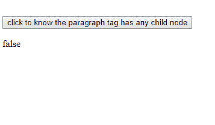
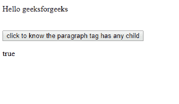

# HTML | DOM hashchildnodes()方法

> 原文:[https://www . geesforgeks . org/html-DOM-haschildnodes-method/](https://www.geeksforgeeks.org/html-dom-haschildnodes-method/)

如果给定节点有一个子节点，则 **HTML hasChildNodes()** 属性将返回 true，如果没有任何子节点，则返回 false。空行或空白也被视为子节点，因此它在空行或空白上也返回 true。
先决条件 [DOM(文档对象模型)](https://www.geeksforgeeks.org/dom-document-object-model/)
**参数:**
不需要参数。
**返回值:**HTML nodeValue 属性返回以下类型的值。

*   **如果给定节点有子节点或空格或空行，则为真**。
*   **如果给定节点没有任何子节点，则为假**。

**语法**

```html
node.hasChildNodes()
```

示例-1:在下面的段落中，标签没有任何内容，因此它返回 false

## 超文本标记语言

```html
<!DOCTYPE html>
<html>

<body>

    <head>
        <script>

            // utility function to demonstrate hasChildNode  Property
            function exampleFunction() {

                // var x used to get the information of those node 
                // for which you want to perform 
                // hasChildNode properties
                var res = 
                document.getElementById("divId").hasChildNodes();

                document.getElementById("GeeksForGeeks"+
                ).innerHTML = res;
            }
        </script>
    </head>

    <!--In this example we will create a node of the type div
     and a button which calls a function name "exampleFunction" 
     on clicking of this button it will show the properties of 
     hasChildNode property -->
    <p id="divId"></p>

    <br>

    <button onclick="exampleFunction()">
      click to know the paragraph tag has any child node
    </button>

    <!-- below paragraph Tag is used to 
    print the value of nodeValue properties-->
    <p id="GeeksForGeeks"></p>

</body>

</html>
```

**输出:**



例-2:在下面的段落中标签有一个信息，所以它返回真

## 超文本标记语言

```html
<!DOCTYPE html>
<html>

<body>

    <head>

        <script>

            // utility function to demonstrate hasChildNode Property
            function exampleFunction() {

                // var x used to get the information of those nodes
                // for which you want to perform 
                // hasChildNode properties.
                var res = 
                document.getElementById("divId").hasChildNodes();

                document.getElementById("GeeksForGeeks"+
                ).innerHTML = res;
            }
        </script>
    </head>
    <!--In this example we will create a node of the type div
     and a button which calls a function name "exampleFunction" 
     on clicking of this button it will show the properties of 
     hasChildNode property -->
    <p id="divId">Hello geeksforgeeks</p>

    <br>

    <button onclick="exampleFunction()">
      click to know the paragraph tag has any child
    </button>

    <!-- below paragraph Tag is used to print the 
         value of nodeValue properties-->
    <p id="GeeksForGeeks"></p>

</body>

</html>
```

**输出:**



**支持的浏览器:**DOM click()方法支持的浏览器如下:

*   谷歌 Chrome
*   苹果 Safari
*   火狐浏览器
*   歌剧
*   边缘