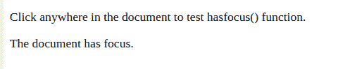

# HTML | DOM hasFocus()方法

> 原文:[https://www.geeksforgeeks.org/html-dom-hasfocus-method/](https://www.geeksforgeeks.org/html-dom-hasfocus-method/)

在 HTML 文档中， **document.hasfocus(** )该方法用于指示元素或文档是否有焦点。如果元素被聚焦，函数返回真值，否则返回假值。此方法可用于确定活动元素当前是否处于焦点上。

**语法**

```html
document.hasfocus();

```

**参数:**该方法没有参数。

**返回值:**has focus()方法返回一个布尔值，该值指示元素或文档是否有焦点。

以下示例说明了 HTML DOM hasfocus()方法:

**示例 1:** 本示例说明文档是否有焦点。

```html
<!DOCTYPE html>
<html>
    <title>
        HTML | DOM hasFocus() Method
    </title>
<body>
    <p>
       Click anywhere in the document to 
       test hasfocus() function.
    </p>
    <p id="para"></p>
    <script>
        setInterval("hasfocustest()", 1);

        function hasfocustest() {
            var x = document.getElementById("para");
            if (document.hasFocus()) {
                x.innerHTML = 
                    "The document has focus.";
            } else {
                x.innerHTML = 
                    "The document DOES NOT have focus.";
            }
        }
    </script>
</body>

</html>                    
```

### 输出:

**最初** :


**在文档**中按下后:


**解释:**set interval()函数在 1 毫秒内调用 hasfocustest()，求值后产生结果。

**示例 2:** 该示例说明了基于文档是否有焦点来改变标题的背景颜色。

```html
<!DOCTYPE html>
<html>
<head>
    <title>
        HTML | DOM hasFocus() Method
    </title>
</head>
<body>
    <p>
     Click anywhere in the document to 
     test hasfocus() function.
    </p>
    <h1 id="para"> Function Testing</h1>
    <script>
        setInterval("hasfocustest()", 1);

        function hasfocustest() {
            var x = document.getElementById("para");
            if (document.hasFocus()) {
                x.style.background = "palegreen";
            } else {
                x.style.background = "white";
            }
        }
    </script>
</body>

</html>
</html>
```

### 输出:

**最初** :


**在文档**中按下后:


**支持的浏览器:**下面列出了*方法支持的浏览器:*

*   *谷歌 Chrome 30.0*
*   *Internet Explorer 6.0*
*   *Firefox 3.0*
*   *Opera 23.0*
*   *旅行队*