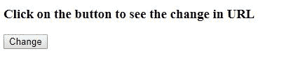
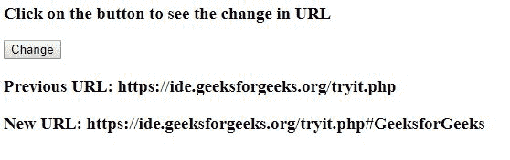
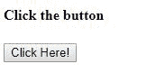
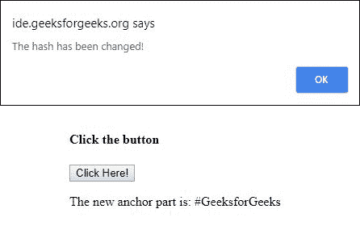

# html | DOM hashchangeevent

> 哎哎哎:# t0]https://www . geeksforgeeks . org/html-DOM-hashchangeevent/

HTML DOM 中的 HashChangeEvent 是当 URL 的散列被改变时触发的事件之间的接口。网址的锚点部分跟在#符号后面。
**支持的标签**

*   **<体>**

**属性/方法:**

*   **newURL:** 此属性用于在片段标识符更改后返回文档的 URL。
    **语法:**

```html
event.newURL
```

*   **oldURL:** 此属性用于返回哈希(锚点部分)更改前文档的 URL。
    **语法:**

```html
event.oldURL
```

**onhashchange 事件:**当前网址的哈希发生变化时，会出现此属性。**语法:**

```html
<element onhashchange = "script">
```

**例 1:**

## 超文本标记语言

```html
<!DOCTYPE html>
<html>

<head>
    <title>
        HTML DOM HashChangeEvent
    </title>
</head>

<body onhashchange = "GFG(event)">

    <h3>
        Click on the button to see the change in URL
    </h3>

    <button onclick = "geeks()">
        Change
    </button>

    <p id = "sudo"></p>

    <script>

        // Use location.hash property to
        // change the anchor part
        function geeks() {
            location.hash = "#GeeksforGeeks";
        }

        function GFG() {
            document.getElementById("sudo").innerHTML
                = "<h3>Previous URL: " + event.oldURL
                    + "<h3>New URL: " + event.newURL;
        }
    </script>
</body>

</html>                   
```

**输出:**
**之前点击按钮:**



**点击按钮后:**



**例 2:**

## 超文本标记语言

```html
<!DOCTYPE html>
<html>

<head>
    <title>
        HTML DOM HashChangeEvent
    </title>
</head>

<body onhashchange = "GFG()">

    <h4>Click the button</h4>

    <button onclick = "geeks()">
        Click Here!
    </button>

    <p id = "sudo"></p>

    <script>
        function geeks() {
            location.hash = "#GeeksforGeeks";
            var x = location.hash;
            document.getElementById("sudo").innerHTML
                = "The new anchor part is: " + x;
        }

        function GFG() {
            alert("The hash has been changed!");
        }
    </script>
</body>

</html>                                     
```

**输出:**
**之前点击按钮:**



**点击按钮后:**



**支持的浏览器:**T2 DOM hashchangevent 属性支持的浏览器如下:

*   谷歌 Chrome 5.0
*   Internet Explorer 8.0
*   Firefox 3.6
*   Safari 5.0
*   歌剧 10.6