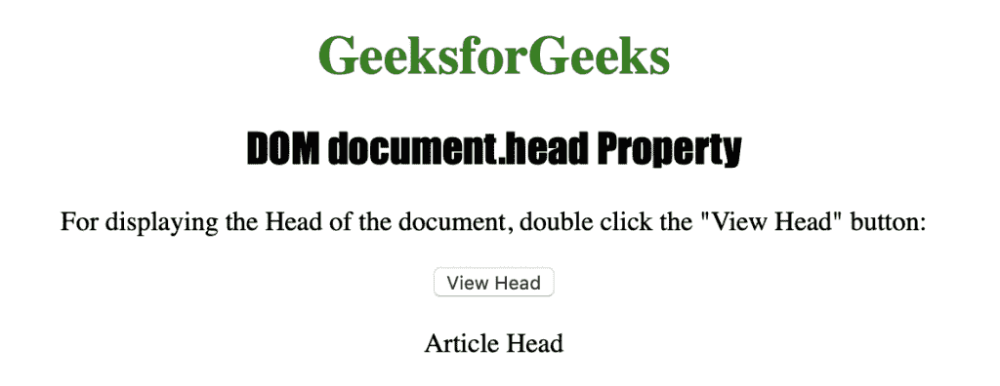

# HTML | DOM 头属性

> 原文:[https://www.geeksforgeeks.org/html-dom-head-property/](https://www.geeksforgeeks.org/html-dom-head-property/)

如果文档中有多个标题，HTML 中的**标题属性**用于返回标题的第一次出现。返回头部对象的引用，表示<头部>元素
**语法:**

```html
document.head
```

返回值:-返回头部对象的柠檬。

下面的程序用 HTML 说明了 document.head 属性:
**示例:**

## 超文本标记语言

```html
<!DOCTYPE html>
<html>
    <head id="Article Head">
        <title>
            DOM document.head() Property in HTML
        </title>
        <style>
            h1 {
                color:green;
            }
            h2 {
                font-family: Impact;
            }
            body {
                text-align:center;
            }
        </style>
    </head>
    <body>
        <h1>GeeksforGeeks</h1>
        <h2>DOM document.head Property</h2>

<p>
         For displaying the Head of the document,
         double click the "View Head" button:
        </p>

        <button ondblclick="myHead()">
         View Head
        </button>
        <p id="head"></p>

        <script>
            function myHead() {
                var gfg = document.head.id;
                document.getElementById("head").innerHTML = gfg;
            }
        </script>
    </body>
</html>                   
```

**输出:**



**支持的浏览器:***DOM head 属性*支持的浏览器如下:

*   谷歌 Chrome 4.0
*   苹果 Safari 5.0
*   Firefox 4.0
*   Opera 11.0
*   Internet Explorer 9.0