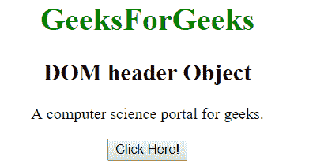
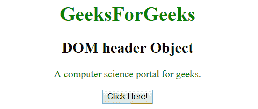
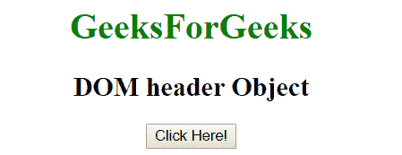
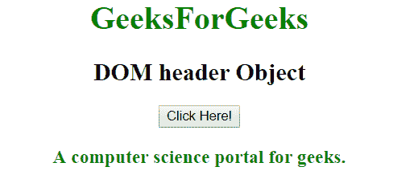

# HTML | DOM 表头对象

> 原文:[https://www.geeksforgeeks.org/html-dom-header-object/](https://www.geeksforgeeks.org/html-dom-header-object/)

**DOM 头对象**用于表示 HTML <头>元素。标题元素可以通过 **getElementById()** 方法访问。

**语法:**

```html
document.getElementById("id"); 
```

其中‘id’是分配给**标题**标签的 ID。

**示例-1:** 在下面的程序中，标题元素被访问，并且标题元素内的文本颜色被改变。

## 超文本标记语言

```html
<!DOCTYPE html>
<html>
<body>
<center>
        <h1 style = "color:green;" >
          GeeksForGeeks
        </h1>

        <h2>DOM header Object</h2>

        <article>
          <header id="head">

<p>A computer science portal for geeks.</p>

          </header>
        </article>

        <button onclick="Geeks()">Click Here!</button>

        <script>
        function Geeks() {
            var doc = document.getElementById("head");
            doc.style.color = "green";
        }
        </script>
</body>
</html>
```

**输出:**
**点击按钮前:**



**点击按钮后:**



**示例-2:** 可以使用 **document.createElement** 方法创建头对象。

## 超文本标记语言

```html
<!DOCTYPE html>
<html>
<body>
<center>
        <h1 style = "color:green;" >
          GeeksForGeeks
        </h1>

        <h2>DOM header Object</h2>

        <button onclick="Geeks()">Click Here!</button>
        <p id="head" style="color:green;"></p>

        <script>
        function Geeks() {
          var x = document.createElement("HEADER");
          document.body.appendChild(x);

          var doc = document.createElement("H3");
          var t = document.createTextNode("A computer
          science portal for geeks.");
          doc.appendChild(t);

          document.getElementById("head").appendChild(doc);
        }
        </script>
</body>
</html>
```

**输出:**
**点击按钮前:**



**点击按钮后:**



**支持的浏览器:**

*   谷歌 Chrome
*   Mozilla Firefox
*   internet Explorer(IE 8.0 之后)
*   旅行队
*   歌剧