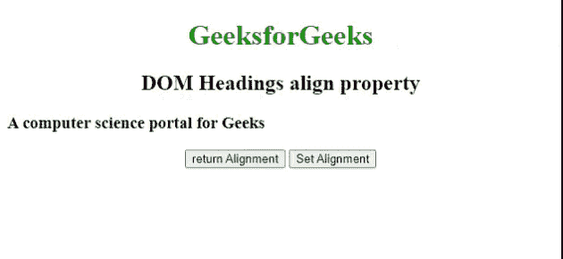

# HTML DOM 标题对齐属性

> 原文:[https://www . geesforgeks . org/html-DOM-heading-align-property/](https://www.geeksforgeeks.org/html-dom-heading-align-property/)

**[**HTML DOM**](https://www.geeksforgeeks.org/html-dom-html-object/)**[**标题**](https://www.geeksforgeeks.org/html-heading/) **对齐**属性用于设置或返回< h1 >到< h6 >元素的水平对齐。****

******语法:******

****用于返回*对齐*属性。****

```html
**HeadingObject.align;**
```

****用于设置*对齐*属性。****

```html
**HeadingObject.align="left | right | center | justify";**
```

******属性值:******

*   ******左:**设置文本左对齐。****
*   ******右**:设置文本右对齐。****
*   ******居中:**设置文本居中对齐。****
*   ******对齐:**拉伸段落文本，使所有行的宽度相等。****

******示例:**下面的 HTML 代码返回并设置[标题](https://www.geeksforgeeks.org/html-heading/)为*对齐*属性。****

## ****超文本标记语言****

```html
**<!DOCTYPE html>
<html>

<body>
    <center>
        <h1 style="color:green;">
            GeeksforGeeks
        </h1>

        <h2> DOM Headings align property </h2>

        <h3 id="headingID" align="left">
            A computer science portal for Geeks
        </h3>

        <button onclick="get()">
            return Alignment
        </button>

        <button onclick="set()">
            Set Alignment
        </button>

        <p id="paraID"></p>

        <script>
            function get() {

                // Accessing heading.
                var g = document.getElementById(
                    "headingID").align;

                document.getElementById(
                    "paraID").innerHTML = g;
            }

            function set() {

                // Accessing heading.
                var k = document.getElementById(
                    "headingID").align = "right";

                document.getElementById(
                    "paraID").innerHTML = k;
            }
        </script>
    </center>
</body>

</html>**
```

******输出:******

********

******支持的浏览器:******

*   ****谷歌 Chrome****
*   ****微软公司出品的 web 浏览器****
*   ****歌剧****
*   ****苹果 Safari****
*   ****火狐浏览器****