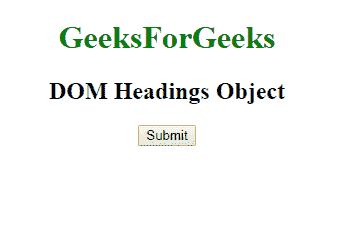
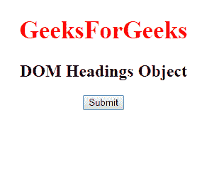
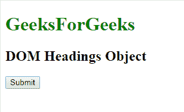
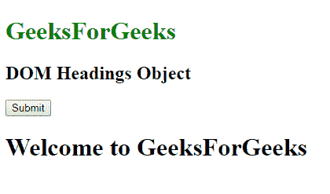

# HTML | DOM 标题对象

> 原文:[https://www.geeksforgeeks.org/html-dom-heading-object/](https://www.geeksforgeeks.org/html-dom-heading-object/)

**DOM 标题对象**用于表示 HTML [**<标题>**](https://www.geeksforgeeks.org/html-heading/) 元素。标题元素由 **getElementById()** 访问。
**属性:**

*   [**align:**](https://www.geeksforgeeks.org/html-dom-heading-align-property/?ref=rp) 该元素包含一个 align 属性，用于设置或返回标题元素的对齐方式。

**语法:**

```html
document.getElementById("ID");
```

其中**“id”**是分配给**“标题”**标签的 ID。
**例-1:**

## 超文本标记语言

```html
<!DOCTYPE html>
<html>

<body>
    <center>

        <!-- assigning id to h1\. -->
        <h1 id="GFG" style="color:green;">
          GeeksForGeeks
        </h1>
        <h2> DOM Headings Object </h2>

        <button onclick="myGeeks()">
          Submit
        </button>

        <script>
            function myGeeks() {

                //  Accessing heading.
                var g = document.getElementById("GFG");
                g.style.color = "red";
                g.style.fontSize = "35px";
            }
        </script>
    </center>
</body>

</html>
```

**输出:**
**点击按钮前:**



**点击按钮后:**



**示例-2:** 可以使用**文档.创建元素**方法创建标题对象。

## 超文本标记语言

```html
<!DOCTYPE html>
<html>

<body>
    <h1 id="GFG" style="color:green;">
      GeeksForGeeks
    </h1>
    <h2> DOM Headings Object </h2>
    <button onclick="myGeeks()">Submit</button>
    <script>
        function myGeeks() {

            //  Creating "H1" heading.
            var g = document.createElement("H1");
            var f = document.createTextNode(
              "Welcome to GeeksForGeeks");
            g.appendChild(f);
            document.body.appendChild(g);
        }
    </script>
</body>

</html>
```

**输出:**
**点击按钮前:**



**点击按钮后:**



**支持的浏览器:**T2 DOM 标题对象支持的浏览器如下:

*   谷歌 Chrome
*   微软公司出品的 web 浏览器
*   火狐浏览器
*   歌剧
*   旅行队