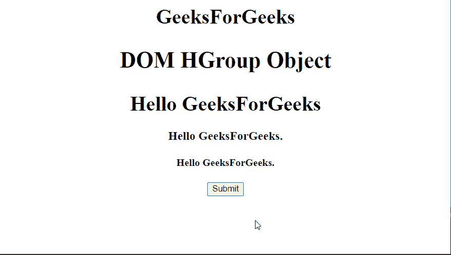
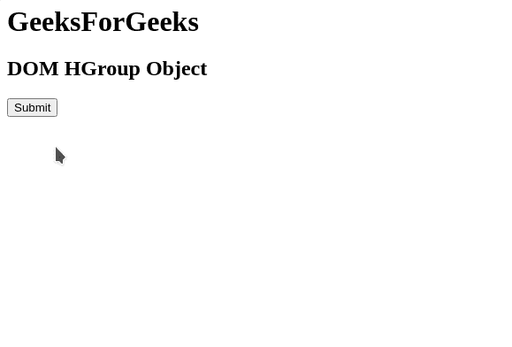

# 超文本标记语言文档组对象

> 原文:[https://www.geeksforgeeks.org/html-dom-hgroup-object/](https://www.geeksforgeeks.org/html-dom-hgroup-object/)

**DOM 组对象**用于表示 HTML <组>元素。可以使用 JavaScript 中的任何选择器进行访问，比如 *getElementById()* 。

**语法:**

```html
document.getElementById("hgroupid");
```

以下示例演示了**组对象**的使用。

**示例 1:** 在此示例中，HGroup 元素的背景颜色更改为绿色。

## 超文本标记语言

```html
<!DOCTYPE html>
<html>

<body>
    <center>
        <h1>GeeksForGeeks</h1>
        <h2 style="font-size:35px;">
            DOM HGroup Object
        </h2>

        <!-- Using the HTML hgroup tag -->
        <hgroup id="GFG">
            <h1>Hello GeeksForGeeks</h1>
            <h3>Hello GeeksForGeeks.</h3>
            <h4>Hello GeeksForGeeks.</h4>
        </hgroup>
        <button onclick="myGeeks()">
            Submit
        </button>
    </center>

    <p id="geeks"></p>

    <script>
        function myGeeks() {
            var b = document.getElementById("GFG");
            b.style.backgroundColor = "green";
        }
    </script>
</body>

</html>
```

**输出:**



**示例 2:** 在本例中，可以使用 document.createElement()方法创建 HGroup 对象。

## 超文本标记语言

```html
<!DOCTYPE html>
<html>

<head>
    <script>
        function myGeeks() {
            var x = document.createElement("HGROUP");
            document.body.appendChild(x);

            var Hg1 = document.createElement("H3");
            var txt = document.createTextNode(
                "GeeksForGeeks"
            );
            elemh1.appendChild(txt);
            x.appendChild(Hg1);

            var Hg2 = document.createElement("H4");
            var txt2 = document.createTextNode(
                "A computer science portal for Geek."
            );
            elemh2.appendChild(txt2);
            x.appendChild(Hg2);
        }
    </script>
</head>

<body>
    <H1>GeeksForGeeks</H1>
    <h2>DOM HGroup Object</h2>
    <button onclick="myGeeks()">
        Submit
    </button>
    <p id="sudo"></p>

</body>

</html>
```

**输出:**



**支持的浏览器:**

*   谷歌 Chrome 5 及以上版本
*   Internet Explorer 9 及以上版本
*   Firefox 4 及以上版本
*   Opera 11.1 及以上
*   Safari 5 及以上
*   边缘 12 及以上