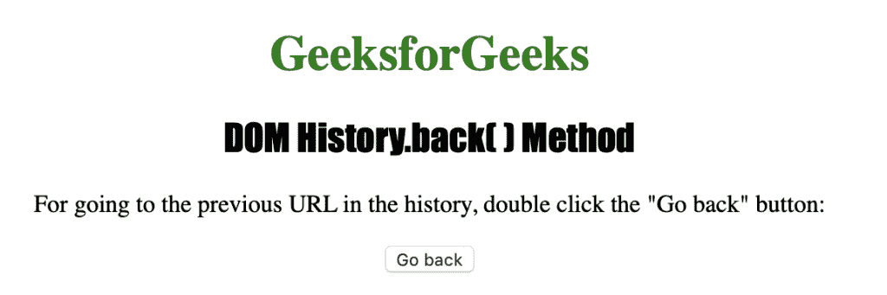

# HTML | DOM 历史回溯()方法

> 原文:[https://www.geeksforgeeks.org/html-dom-history-back-method/](https://www.geeksforgeeks.org/html-dom-history-back-method/)

HTML 中的**历史回()**方法用于加载历史列表中的上一个 URL。它与我们的网络浏览器中的后退按钮具有相同的实际应用。如果上一页不存在，此方法将不起作用。此方法不包含任何参数。
**语法:**

```html
history.back
```

下面程序用 HTML 说明了 History back()方法:
**示例:**

## 超文本标记语言

```html
<!DOCTYPE html>
<html>
    <head>
        <title>DOM History.back() Method</title>
        <style>
            h1 {
                color:green;
            }
            h2 {
                font-family: Impact;
            }
            body {
                text-align:center;
            }
        </style>
    </head>
    <body>
        <h1>GeeksforGeeks</h1>
        <h2>DOM History.back() Method</h2>
        <p>For going to the previous URL in the history,
        double-click the "Go back" button: </p>
        <button ondblclick="history_back()">Go back</button>
        <script>
            function history_back() {
                window.history.back();
            }
        </script>
    </body>
</html>                   
```

**注意:**这里这个按钮不会起作用，因为没有以前的 url，可以尝试复制 ide url 并打开任意站点粘贴 ide 并复制粘贴代码并运行。
**输出:**



**点击按钮后:**


**支持的浏览器:**History back()方法支持的浏览器如下:

*   谷歌 Chrome
*   微软公司出品的 web 浏览器
*   火狐浏览器
*   歌剧
*   旅行队