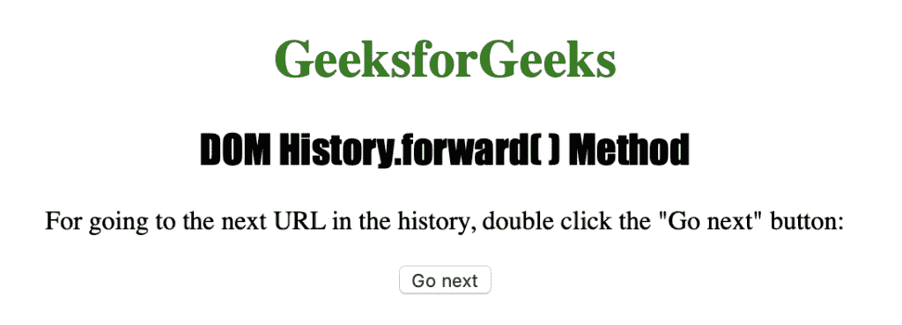
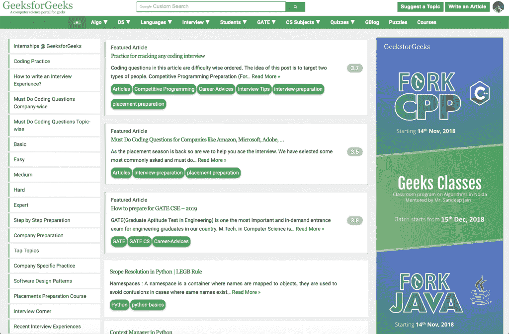

# HTML | DOM 历史转发()方法

> 原文:[https://www . geesforgeks . org/html-DOM-history-forward-method/](https://www.geeksforgeeks.org/html-dom-history-forward-method/)

HTML 中的**历史转发()**方法用于加载历史列表中的下一个 URL。它与 web 浏览器中的前进按钮具有相同的实际应用。如果历史列表中不存在下一页，此方法将不起作用。

**语法:**

```html
history.forward
```

下面的程序用 HTML 说明了历史转发()方法:

**示例:**

```html
<!DOCTYPE html>
<html>
    <head> 
        <title>DOM History.forward() Method</title> 
        <style> 
            h1 { 
                color:green; 
            } 
            h2 {
                font-family: Impact;
            }
            body { 
                text-align:center; 
            } 
        </style> 
    </head>
    <body>
        <h1>GeeksforGeeks</h1> 
        <h2>DOM History.forward( ) Method</h2> 
        <p>
          For going to the next URL in the history
          double-click the "Go next" button: 
        </p>
        <button ondblclick="history_forward()">
          Go next
        </button>
        <script>
            function history_forward() {
                window.history.forward(); 
            }
        </script>
    </body>
</html>                    
```

**输出:**

**点击按钮后:**


**支持的浏览器:**以下是**历史转发()**方法支持的浏览器:

*   谷歌 Chrome
*   微软公司出品的 web 浏览器
*   火狐浏览器
*   歌剧
*   旅行队