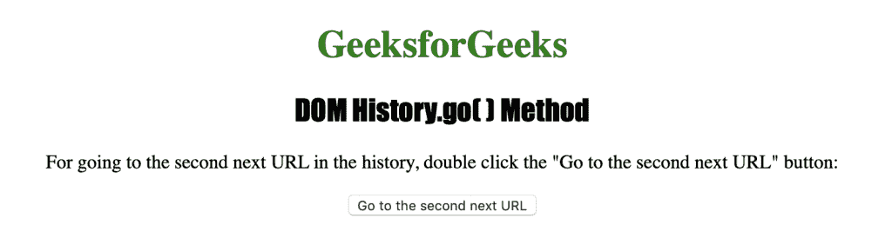
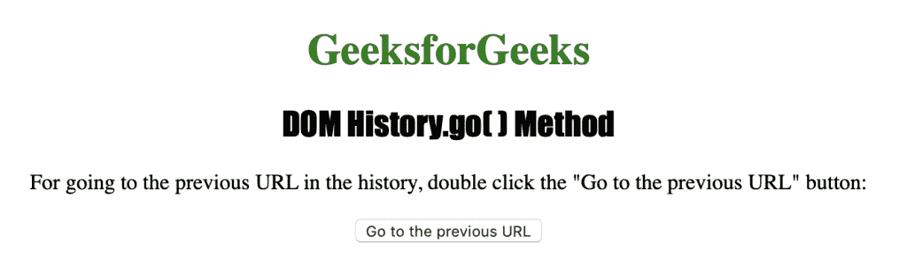

# HTML | DOM 历史 go()方法

> 原文:[https://www.geeksforgeeks.org/html-dom-history-go-method/](https://www.geeksforgeeks.org/html-dom-history-go-method/)

HTML 中的**历史 go()** 方法用于从历史列表中加载特定的 URL。如果知道要从您的历史中加载的特定页面的号码或网址，这是 **history.back()** 和 history.forward()方法的更好选择。

**语法:**

```html
history.go( number|URL )

```

**参数:**该方法接受单个参数*号|网址*，该参数为必选项，用于指定网址在历史列表中的编号/位置或页面的网址。-1 用于后退一页，1 用于前进一页。

下面的程序用 HTML 说明了历史 go()方法:

**示例:**

## 超文本标记语言

```html
<!DOCTYPE html>
<html>
    <head>
        <title>DOM History.go() Method</title>
        <style>
            h1 {
                color:green;
            }
            h2 {
                font-family: Impact;
            }
            body {
                text-align:center;
            }
        </style>
    </head>
    <body>
        <h1>GeeksforGeeks</h1>
        <h2>DOM History.go( ) Method</h2>

<p>
         For going to the second next URL in the
         history, double click the "Go to the
         second next URL" button:
        </p>

        <button ondblclick="history_goforward()">
          Go to the second next URL
        </button>
        <script>
            function history_goforward() {
                window.history.go(2);
            }
        </script>
    </body>
</html>                   
```

**输出:**



**示例 2:** 用于转到历史列表中的上一个网址。

## 超文本标记语言

```html
<!DOCTYPE html>
<html>
    <head>
        <title>DOM History.go() Method</title>
        <style>
            h1 {
                color:green;
            }
            h2 {
                font-family: Impact;
            }
            body {
                text-align:center;
            }
        </style>
    </head>
    <body>
        <h1>GeeksforGeeks</h1>
        <h2>DOM History.go() Method</h2>

<p>
         For going to the previous URL in the
         history, double click the "Go to the
         previous URL" button:
        </p>

        <button ondblclick="history_goback()">
         Go to the previous URL
        </button>
        <script>
            function history_goback() {
                window.history.go(-1);
            }
        </script>
    </body>
</html>                   
```

**输出:**



**支持的浏览器:**History go()方法支持的浏览器如下:

*   谷歌 Chrome
*   微软公司出品的 web 浏览器
*   火狐浏览器
*   歌剧
*   旅行队