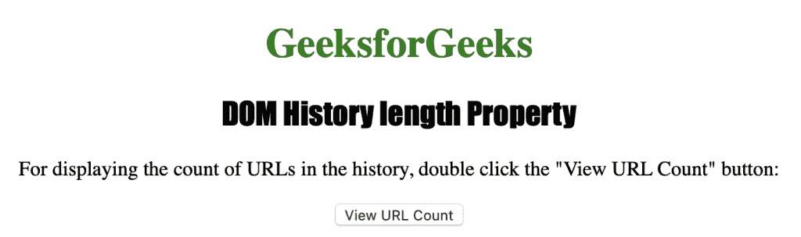
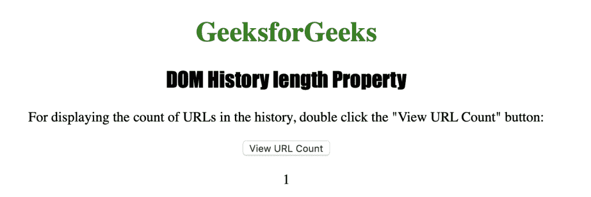

# HTML | DOM 历史长度属性

> 原文:[https://www . geesforgeks . org/html-DOM-history-length-property/](https://www.geeksforgeeks.org/html-dom-history-length-property/)

HTML 中的**历史长度属性**用于返回当前浏览器窗口历史列表中的 URL 计数。此属性返回的最小值是 1，因为当前页面是在此时加载的，而可以显示的最大计数是 50。互联网浏览器和 opera 等网络浏览器以 0 开始计数。
**语法:**

```html
history.length
```

**返回值:**它返回一个代表会话历史中条目数量的数值。

下面的程序用 HTML 说明了历史长度属性:
**示例:**

## 超文本标记语言

```html
<!DOCTYPE html>
<html>
    <head>
        <title>DOM History length Property</title>
        <style>
            h1 {
                color:green;
            }
            h2 {
                font-family: Impact;
            }
            body {
                text-align:center;
            }
        </style>
    </head>
    <body>
        <h1>GeeksforGeeks</h1>
        <h2>DOM History length Property</h2>

<p>
         For displaying the count of URLs in the
         history, double click the "View URL Count"
         button:
        </p>

        <button ondblclick="history_length()">
         View URL Count
        </button>
        <p id="history"></p>

        <script>
            function history_length() {
                var h = history.length;
                document.getElementById("history").innerHTML = h;
            }
        </script>
    </body>
</html>                   
```

**输出:**



**点击按钮后:**



**支持的浏览器:**历史长度属性支持的浏览器如下:

*   谷歌 Chrome
*   微软公司出品的 web 浏览器
*   火狐浏览器
*   歌剧
*   旅行队