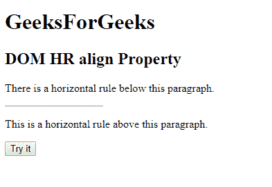
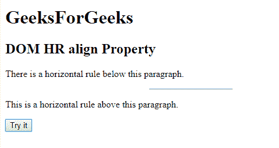
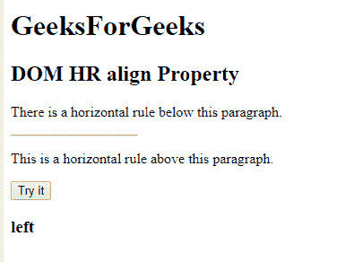

# HTML | DOM HR 对齐属性

> 原文:[https://www.geeksforgeeks.org/html-dom-hr-align-property/](https://www.geeksforgeeks.org/html-dom-hr-align-property/)

**HTML DOM HR align 属性**用于设置或返回 **< hr >** 元素的 align 属性的值。

**语法:**

*   它返回人力资源对齐属性。

    ```html
    hrobject.align;
    ```

*   它设置人力资源对齐属性。

    ```html
    hrobject.align="left | right | center"
    ```

**属性值:**

*   **左:**设置左对齐水平线。
*   **中心:**设置中心对齐水平线。这是默认值。
*   **右:**设置右对齐水平线。

**返回值:**返回一个字符串值，代表 HR 元素的对齐方式。

**示例 1:** 本示例设置 HR 对齐属性。

```html
<!DOCTYPE html>
<html>

<head>
    <title>HTML DOM hr align property</title>
</head>

<body>
    <H1>GeeksForGeeks</H1>
    <h2>DOM HR align Property</h2>
    <p>There is a horizontal rule below this paragraph.</p>

    <!-- Assigning id to 'hr' tag. -->
    <hr id="GFG" 
        align="left" 
        width="140px">

    <p>This is a horizontal rule above this paragraph.</p>
    <button onclick="myGeeks()">Try it</button>

    <script>
        function myGeeks() {

            // Accessing 'hr' tag. 
            var x = 
                document.getElementById("GFG").align = 
                "center";
        }
    </script>
</body>

</html>
```

**输出:**

*   **点击按钮前:**
    
*   **点击按钮后:**
    

**示例 2:** 本示例返回 HR align 属性。

```html
<!DOCTYPE html>
<html>

<head>
    <title>HTML DOM hr align property</title>
</head>

<body>
    <H1>GeeksForGeeks</H1>
    <h2>DOM HR align Property</h2>
    <p>There is a horizontal rule below this paragraph.</p>

    <!-- Assigning id to 'hr' tag. -->
    <hr id="GFG" align="left" width="140px">

    <p>This is a horizontal rule above this paragraph.</p>
    <button onclick="myGeeks()">Try it</button>
    <h3 id="sudo"></h3>
    <script>
        function myGeeks() {

            // Accessing 'hr' tag. 
            var x = document.getElementById("GFG").align;
            document.getElementById("sudo").innerHTML = x;
        }
    </script>
</body>

</html>
```

**输出:**

*   **点击按钮前:**
    
*   **点击按钮后:**
    

**支持的浏览器:**T2 DOM HR align Property 支持的浏览器如下:

*   谷歌 Chrome
*   微软公司出品的 web 浏览器
*   火狐浏览器
*   苹果 Safari
*   歌剧