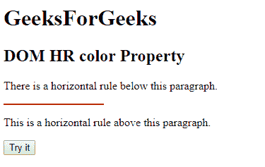
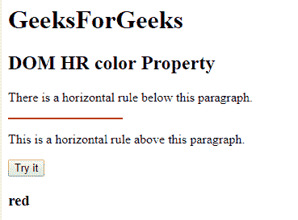
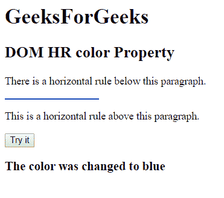

# HTML | DOM HR 颜色属性

> 原文:[https://www.geeksforgeeks.org/html-dom-hr-color-property/](https://www.geeksforgeeks.org/html-dom-hr-color-property/)

**DOM HR 颜色属性**用于设置或返回< hr >元素的颜色属性值。

**语法:**

*   它返回一个人力资源颜色属性。

    ```html
    hrobject.color
    ```

*   它设置人力资源颜色属性。

    ```html
    hrobject.color="value"
    ```

**属性值:**

*   **color_name:** 使用颜色名称保存文本颜色。例如:**“红”。**
*   **hex_number:** 通过使用颜色十六进制编码来保存文本颜色。例如:**“# 0000 ff”。**
*   **rgb_number:** 用 rgb 码保存文字颜色。例如:**“RGB(0，153，0)”**。

**返回值:**返回一个字符串值，代表 HR 元素的颜色。

**示例 1:** 本示例使用 DOM HR 颜色属性返回 HR 颜色属性。

```html
<!DOCTYPE html> 
<html> 

<head> 
    <title>HTML DOM hr color property</title> 
</head> 

<body> 
    <H1>GeeksForGeeks</H1> 

    <h2>DOM HR color Property</h2> 

    <p>
        There is a horizontal rule
        below this paragraph.
    </p> 

    <!-- Assigning id to 'hr' tag. -->
    <hr id="GFG" align="left" width="140px" color="red"> 

    <p>
        This is a horizontal rule
        above this paragraph.
    </p> 

    <button onclick="myGeeks()">Try it</button>

    <h3 id="sudo"></h3>

    <script> 
        function myGeeks() { 

            // Accessing 'hr' tag
            var x = document.getElementById("GFG").color;
            document.getElementById("sudo").innerHTML = x;
        } 
    </script> 
</body> 

</html>
```

**输出:**

*   **点击按钮前:**
    
*   **点击按钮后:**
    

**示例 2:** 本示例使用 DOM HR 颜色属性设置 HR 颜色属性。

```html
<!DOCTYPE html> 
<html> 

<head> 
    <title>HTML DOM hr color property</title> 
</head> 

<body> 
    <H1>GeeksForGeeks</H1> 

    <h2>DOM HR color Property</h2> 

    <p>
        There is a horizontal rule
        below this paragraph.
    </p> 

    <!-- Assigning id to 'hr' tag. -->
    <hr id="GFG" align="left" width="140px" color="red"> 

    <p>
        This is a horizontal rule
        above this paragraph.
    </p> 

    <button onclick="myGeeks()">Try it</button> 

    <h3 id="sudo"></h3>

    <script> 
        function myGeeks() { 

            // Accessing 'hr' tag
            var x = document.getElementById("GFG").color
                        = "blue";

            document.getElementById("sudo").innerHTML
                        = "The color was changed to " + x;
        } 
    </script> 
</body> 

</html>
```

**输出:**

*   **点击按钮前:**
    
*   **点击按钮后:**
    