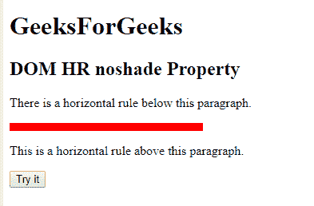
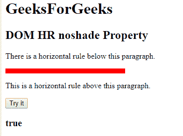
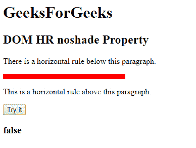

# HTML | DOM HR noshade 属性

> 原文:[https://www.geeksforgeeks.org/html-dom-hr-noshade-property/](https://www.geeksforgeeks.org/html-dom-hr-noshade-property/)

**DOM HR noshade 属性**用于设置或返回一条实心水平线，而不是阴影线。它返回一个布尔值。

**语法:**

*   它返回 HR noshade 属性。

    ```html
    hrobject.noshade 
    ```

*   它设置 HR noshade 属性。

    ```html
    hrobject.noshade="true/false" 
    ```

**属性值:**

*   **true:** 用于指定水平实线，而不是阴影线。
*   **false:** 用于指定阴影线。

**示例 1:** 本示例返回一个 noshade 属性。

```html
<!DOCTYPE html> 
<html> 

<head> 
    <title>HTML DOM HR noshade property</title> 
</head> 

<body> 
    <h1>GeeksForGeeks</h1> 
    <h2>DOM HR noshade Property</h2> 

    <p>
        There is a horizontal rule
        below this paragraph.
    </p> 

    <!-- Assigning id to 'hr' tag. -->
    <hr id="GFG" align="left" size="10px"
            width="240px" color="red" noshade> 

    <p>
        This is a horizontal rule
        above this paragraph.
    </p>

    <button onclick="myGeeks()">Try it</button> 

    <h3 id="sudo"></h3>

    <script> 
        function myGeeks() { 

            // Accessing 'hr' tag. 
            var x = document.getElementById("GFG").noShade;
            document.getElementById("sudo").innerHTML = x;
        } 
    </script> 
</body> 

</html>
```

**输出:**

*   **点击按钮前:**
    
*   **点击按钮后:**
    

**示例 2:** 本示例设置 HR noshade 属性。

```html
<!DOCTYPE html> 
<html> 

<head> 
    <title>HTML DOM HR noshade property</title> 
</head> 

<body> 
    <h1>GeeksForGeeks</h1> 
    <h2>DOM HR noshade Property</h2> 

    <p>
        There is a horizontal rule
        below this paragraph.
    </p> 

    <!-- Assigning id to 'hr' tag. -->
    <hr id="GFG" align="left" size="10px"
            width="240px" color="red" noshade> 

    <p>
        This is a horizontal rule
        above this paragraph.
    </p>

    <button onclick="myGeeks()">Try it</button> 

    <h3 id="sudo"></h3>

    <script> 
        function myGeeks() { 

            // Accessing 'hr' tag. 
            var x = document.getElementById("GFG").noShade
                            = "false";

            document.getElementById("sudo").innerHTML = x;
        } 
    </script> 
</body> 

</html>
```

**输出:**

*   **点击按钮前:**
    
*   **点击按钮后:**
    

**支持的浏览器:**DOM HR no shade 属性支持的浏览器如下:

*   谷歌 Chrome
*   微软公司出品的 web 浏览器
*   火狐浏览器
*   旅行队
*   歌剧