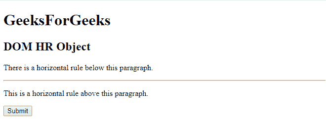
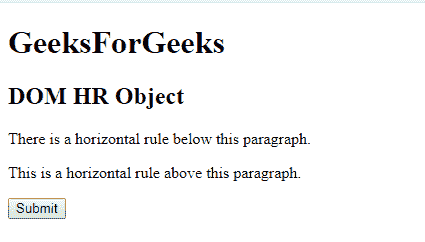
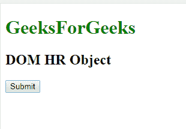
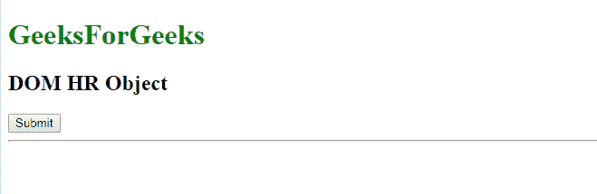

# HTML| DOM HR 对象

> 原文:[https://www.geeksforgeeks.org/html-dom-hr-object/](https://www.geeksforgeeks.org/html-dom-hr-object/)

**DOM HR 对象**用于表示 HTML [< hr >](https://www.geeksforgeeks.org/html-hr-tag/) 元素。通过 **getElementById()** 访问 *hr* 元素。

**属性:**

*   **对齐:**用于设置或返回水平元素的对齐方式。
*   **颜色:**用于设置或返回水平元素的颜色。
*   **noshade:** 用于在水平元素中设置或返回 noshade 属性。
*   **大小:**用于设置或返回水平线的高度。
*   **宽度:**用于设置或返回水平线的宽度。

**语法:**

```html
document.getElementById("ID");
```

其中**“ID”**代表元素 ID。

**示例-1:**

```html
<!DOCTYPE html>
<html>

<head>
    <title>HTML hr tag</title>
</head>

<body>
    <H1>GeeksForGeeks</H1>
    <h2>DOM HR Object</h2>
    <p>There is a horizontal 
      rule below this paragraph.</p>

    <!-- Assigning id to 'hr' tag. -->
    <hr id="GFG">

    <p>This is a horizontal rule above this paragraph.</p>
    <button onclick="myGeeks()">Try it</button>

    <script>
        function myGeeks() {

            // Accessing 'hr' tag. 
            var x = document.getElementById("GFG");
            x.style.display = "none";
        }
    </script>
</body>

</html>
```

**输出:**

**点击按钮前:**


**点击按钮后:**


**示例-2:** 可以使用**文档创建元素方法创建人力资源对象。**

```html
<!DOCTYPE html>
<html>

<head>
    <title>HTML hr tag</title>
</head>

<body>
    <h1 style="color:green;">GeeksForGeeks</h1>
    <h2>DOM HR Object</h2>
    <button onclick="myGeeks()">Submit</button>

    <script>
        function myGeeks() {
            var g = document.createElement("HR");
            document.body.appendChild(g);
        }
    </script>
</body>

</html>                    
```

**输出:**

**点击按钮前:**


**点击按钮后:**


**支持的浏览器:****DOM HR 对象**支持的浏览器如下:

*   谷歌 Chrome
*   微软公司出品的 web 浏览器
*   火狐浏览器
*   歌剧
*   旅行队