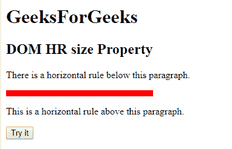
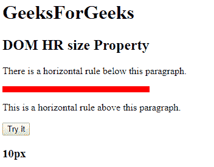
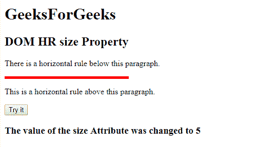

# HTML | DOM HR 大小属性

> 原文:[https://www.geeksforgeeks.org/html-dom-hr-size-property/](https://www.geeksforgeeks.org/html-dom-hr-size-property/)

**DOM HR 大小属性**用于设置或返回< hr >元素的大小属性值。

**语法:**

*   它返回人力资源大小属性。

```html
hrobject.size
```

*   用于设置人力资源规模属性。

```html
hrobject.size="value"
```

**属性值:**

*   **值:**包含指定 HR 元素高度的像素值。

**返回值:**返回代表 HR 元素高度的字符串值。

**示例 1:** 本示例返回 HR 大小属性。

## 超文本标记语言

```html
<!DOCTYPE html>
<html>

<head>
    <title>HTML DOM HR size property</title>
</head>

<body>
    <h1>GeeksForGeeks</h1>
    <h2>DOM HR size Property</h2>

<p>
        There is a horizontal rule
        below this paragraph.
    </p>

    <!-- Assigning id to 'hr' tag. -->
    <hr id="GFG" align="left" size="10px"
                width="240px" color="red">

<p>
        This is a horizontal rule
        above this paragraph.
    </p>

    <button onclick="myGeeks()">
        Try it
    </button>

    <h3 id="sudo"></h3>

    <script>
        function myGeeks() {

            // Accessing 'hr' tag.
            var x = document.getElementById("GFG").size;
            document.getElementById("sudo").innerHTML = x;
        }
    </script>
</body>

</html>
```

*   **点击按钮前:**



*   **点击按钮后:**



**示例 2:** 本示例设置 HR 大小属性。

## 超文本标记语言

```html
<!DOCTYPE html>
<html>

<head>
    <title>HTML DOM HR size property</title>
</head>

<body>
    <H1>GeeksForGeeks</H1>
    <h2>DOM HR size Property</h2>

<p>
        There is a horizontal rule
        below this paragraph.
    </p>

    <!-- Assigning id to 'hr' tag. -->
    <hr id="GFG" align="left" size="10px"
                width="240px" color="red">

<p>
        This is a horizontal rule
        above this paragraph.
    </p>

    <button onclick="myGeeks()">Try it</button>

    <h3 id="sudo"></h3>

    <script>
        function myGeeks() {

            // Accessing 'hr' tag.
            var x =
                document.getElementById("GFG").size = "5";

            document.getElementById("sudo").innerHTML
                    = "The value of the size Attribute "
                    + "was changed to " + x;
        }
    </script>
</body>

</html>
```

*   **点击按钮前:**


*   **点击按钮后:**



**支持的浏览器:**DOM HR 大小属性支持的浏览器如下:

*   谷歌 Chrome
*   微软公司出品的 web 浏览器
*   火狐浏览器
*   旅行队
*   歌剧