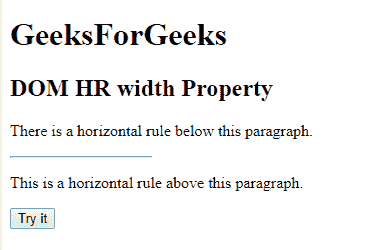
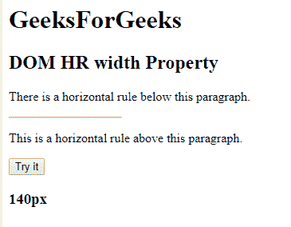
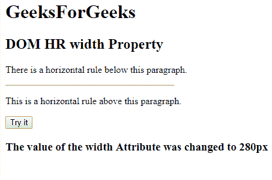

# HTML | DOM HR 宽度属性

> 原文:[https://www.geeksforgeeks.org/html-dom-hr-width-property/](https://www.geeksforgeeks.org/html-dom-hr-width-property/)

**DOM 人力资源宽度属性**用于设置或返回人力资源元素的宽度属性值。
**语法:**

*   它返回一个人力资源宽度属性。

```html
hrobject.width; 
```

*   它设置人力资源宽度属性。

```html
hrobject.width="value";
```

**属性值**

*   **像素:**以像素为单位指定 HR 元素的宽度。

**返回值:**返回一个字符串值，代表一个人力资源元素的宽度。
**示例 1:** 本示例返回 HR 宽度属性。

## 超文本标记语言

```html
<!DOCTYPE html>
<html>

<head>
    <title>HTML DOM hr width property</title>
</head>

<body>
    <H1>GeeksForGeeks</H1>
    <h2>DOM HR width Property</h2>

<p>There is a horizontal
      rule below this paragraph.</p>

    <!-- Assigning id to 'hr' tag. -->
    <hr id="GFG"
        align="left"
        width="140px">

<p>This is a horizontal
      rule above this paragraph.</p>

    <button onclick="myGeeks()">Try it</button>
    <h3 id="sudo"></h3>
    <script>
        function myGeeks() {

            // Accessing 'hr' tag.
            var x = document.getElementById("GFG").width;
            document.getElementById("sudo").innerHTML = x;
        }
    </script>
</body>

</html>
```

**输出:**

*   **点击按钮前:**



*   **点击按钮后:**



**示例 2:** 本示例设置 HR 宽度属性。

## 超文本标记语言

```html
<!DOCTYPE html>
<html>

<head>
    <title>HTML DOM hr width property</title>
</head>

<body>
    <H1>GeeksForGeeks</H1>
    <h2>DOM HR width Property</h2>

<p>There is a horizontal
      rule below this paragraph.</p>

    <!-- Assigning id to 'hr' tag. -->
    <hr id="GFG"
        align="left"
        width="140px">

<p>This is a horizontal rule above this paragraph.</p>

    <button onclick="myGeeks()">Try it</button>
    <h3 id="sudo"></h3>
    <script>
        function myGeeks() {

            // Accessing 'hr' tag.
            var x = document.getElementById("GFG").width = "280px";
            document.getElementById("sudo").innerHTML =
              "The value of the width Attribute was changed to " + x;
        }
    </script>
</body>

</html>
```

**输出:**

*   **点击按钮前:**


*   **点击按钮后:**

