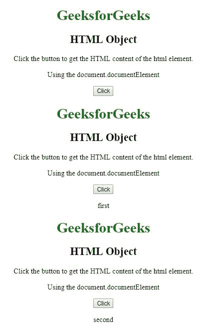

# HTML | DOM HTML 对象

> 原文:[https://www.geeksforgeeks.org/html-dom-html-object/](https://www.geeksforgeeks.org/html-dom-html-object/)

HTML DOM 中的 **HTML 对象**属性用于表示或访问对象中的< html >元素。< html >元素用于将 html 文档作为元素对象返回。

**语法:**

*   它用于访问元素。

    ```html
    var x = document.getElementsByTagName("HTML")[0];
    ```

*   它也可以用来访问元素。

    ```html
    var x = document.documentElement;
    ```

**属性值:**

*   **getElementsByTagName():** 用于返回具有指定标记名的所有子元素的集合。
*   **innerHTML:** 用于设置或返回元素的内容。
*   **getElementsById():** 用于返回具有指定 Id 的所有子元素的集合。

**示例-1:** 使用**文档访问 HTML 元素。**

```html
<!DOCTYPE html>
<html>
<title>
    HTML | DOM HTML Object Property
</title>
<style>
    body {
        text-align: center;
        width: 70%;
    }

    h1 {
        color: green;
    }

    h1,
    h2 {
        text-align: center;
    }
</style>

<body>
    <h1>GeeksforGeeks</h1>
    <h2> HTML Object</h2>

    <p>Click the button to get the 
      HTML content of the html element.</p>

    <button onclick="GFG()">Click</button>

    <p id="Geeks"></p>

    <script>
        function GFG() {

          // Access html element and 
          return using "innerHTML"
          var x = 
          document.getElementsByTagName(
            "HTML")[0].innerHTML;
          document.getElementById("Geeks").innerHTML = x;
      }
    </script>
</body>

</html>
```

**输出:**

**之前点击按钮:**


**点击按钮后:**


**示例-2:** 访问 html 元素，返回元素为**第一**或**第二**。

```html
<!DOCTYPE html>
<html>
<title>
    HTML | DOM HTML Object Property
</title>
<style>
    body {
        text-align: center;
        width: 70%;
    }

    h1 {
        color: green;
    }

    h1,
    h2 {
        text-align: center;
    }
</style>

<body>
    <h1>GeeksforGeeks</h1>
    <h2> HTML Object</h2>

    <p>Click the button to get the 
      HTML content of the html element.</p>
    <p>Using the document.documentElement</p>
    <button onclick="GFG()">Click</button>

    <p id="Geeks"></p>

    <script>
        function GFG() {
            // Access html element and return html 
           // with position value of html element.
            var x = 
            document.documentElement.innerHTML;
            document.getElementById(
              "Geeks").innerHTML = "first" + x;

            var y = 
            document.documentElement.innerHTML;
            document.getElementById(
              "Geeks").innerHTML = y + "second";
        }
    </script>
</body>

</html>
```

**输出:**

**之前点击按钮:**


**点击按钮后:**


**示例-3:** 访问 html 元素，返回所有具有指定标签名的子元素。

```html
<!DOCTYPE html>
<html>
<title>
    HTML | DOM HTML Object Property
</title>
<style>
    body {
        text-align: center;
        width: 70%;
    }

    h1 {
        color: green;
    }

    h1,
    h2 {
        text-align: center;
    }
</style>

<body>
    <h1>GeeksforGeeks</h1>
    <h2> HTML Object</h2>

    <p>Click the button to get the
      HTML content of the html element.</p>
    <p>Using the getElementsByTagName("HTML")[0] 
      and documentElement</p>
    <button onclick="GFG()">Click</button>

    <p id="Geeks"></p>

    <script>
        function GFG() {
            // access and return html element
            var x = 
              document.getElementsByTagName(
                "HTML")[0].innerHTML;
            document.getElementById("Geeks").innerHTML =
              "getElementsByTagName" + x;
            var y = 
             document.documentElement.innerHTML;
            document.getElementById("Geeks").innerHTML =
              y + "documentElement";
        }
    </script>
</body>

</html>
```

**输出:**

**之前点击按钮:**


**点击按钮后:**


**支持的浏览器:****DOM HTML 对象属性**支持的浏览器如下:

*   谷歌 Chrome
*   微软公司出品的 web 浏览器
*   火狐浏览器
*   歌剧
*   旅行队