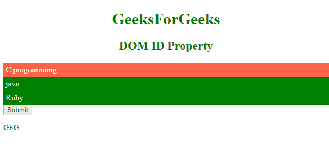

# HTML | DOM id 属性

> 原文:[https://www.geeksforgeeks.org/html-dom-id-property/](https://www.geeksforgeeks.org/html-dom-id-property/)

**DOM 标识属性**用于设置或返回元素的标识，即标识属性的值。文档中的标识应该不同。它是通过使用 document.getElementById()方法返回的。

**语法**

```html
HTMLElementObject.id
```

**返回值:**该语法用于返回 id 属性。

```html
HTMLElementObject.id = id
```

**属性**:包含 ID 属性的值，用于返回 ID 属性。

**例-1:** 获取第一个元素的 ID。

```html
<!DOCTYPE html>
<html>

<head>
    <title>
        HTML | DOM id Property
    </title>
    <style>
        .GEEKS {
            display: block;
            padding: 5px;
            background-color: green;
            color: white;
        }

        #GFG {
            background-color: tomato;
        }
    </style>
</head>

<body>
    <h1 style="color:green;
               font-weight:bold;
               text-align:center;">
     GeeksForGeeks
    </h1>

    <h2 style="color:green;
               font-weight:bold;
               text-align:center">
     DOM ID Property
    </h2>

    <a class="GEEKS" id="GFG" href="#">
      C programming
    </a>
    <a class="GEEKS" href=" # ">
      java
    </a>
    <a class="GEEKS " href="# ">
      Ruby
    </a>

    <button onclick="GEEKS() ">
      Submit
    </button>

    <p id="SUDO "></p>

    <script>
        function GEEKS() {
            var x =
                document.getElementsByClassName("GEEKS ")[0].id;
            document.getElementById("SUDO ").innerHTML = x;
        }
    </script>

</body>

</html>
```

**输出:**


**示例-2:** 更改特定标识处的值。

```html
<!DOCTYPE html>
<html>

<head>
    <title>
        HTML | DOM id Property
    </title>

</head>

<body>
    <center>
        <h1 style="color:green;
                   font-weight:bold;
                   text-align:center;">
         GeeksForGeeks
        </h1>

        <h2 style="color:green;
                   font-weight:bold;
                   text-align:center">
         DOM ID Property
        </h2>

        <p>
          <a id="geeks" href="#">GeeksforGeeks</a>
        </p>

        <button onclick="geeks()">Submit</button>

        <p id="gfg"></p>

        <script>
            function geeks() {
                document.getElementById("geeks").id = "sudo";
                document.getElementById("gfg").innerHTML =
                    "The value of the ID attribute" + 
                    "changed from geeks to sudo";
            }
        </script>
    </center>

</body>

</html>
```

**输出:**


**支持的浏览器:**DOM ID 属性支持的浏览器如下:

*   谷歌 Chrome
*   微软公司出品的 web 浏览器
*   火狐浏览器
*   歌剧
*   旅行队