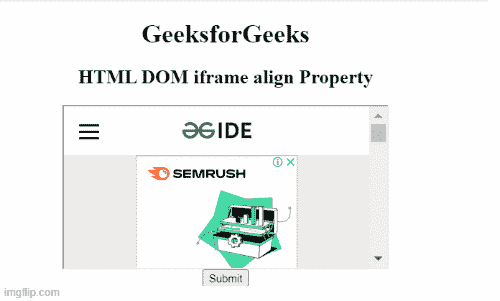

# HTML DOM Iframe 对齐属性

> 原文:[https://www . geesforgeks . org/html-DOM-iframe-align-property/](https://www.geeksforgeeks.org/html-dom-iframe-align-property/)

HTML[**Iframe**](https://www.geeksforgeeks.org/html-iframes/)**[**align**](https://www.geeksforgeeks.org/html-align-attribute/)**属性用于设置或返回< iframe >元素的 align 属性的值。****

******语法:******

****它返回对齐的属性。****

```html
**iframeobject.align;**
```

****它设置对齐属性。****

```html
**Iframeobject.align="left|right|middle|top|bottom"**
```

******属性值:******

*   ******左:**它将框架设置为左对齐。****
*   ******右**:将框架设置为右对齐。****
*   ******中间:**它将帧设置为中间。****
*   ******顶部:**它将框架设置为顶部对齐。****
*   ******底部:**它将框架设置为底部对齐。****

******返回值:**它返回一个表示 Iframe 元素对齐方式的字符串值。****

******示例 1:** 下面的示例说明了如何返回 Iframe *align* 属性。****

## ****超文本标记语言****

```html
**<!DOCTYPE html>
<html>

<body style="text-align:center;">

    <h1>GeeksforGeeks</h1>

    <h2>
        HTML DOM iframe align Property
    </h2>

    <iframe src="https://ide.geeksforgeeks.org/index.php" 
        id="iframeID" align="middle" 
        height="200" width="400">
    </iframe><br>

    <button onclick="click1()">Submit</button>
    <p id="paraID"></p>

    <script>
        function click1() {
            var x = document.getElementById("iframeID").align;
            document.getElementById("paraID").innerHTML = x;
        }
    </script>
</body>

</html>**
```

******输出:******

********

******示例 2:** 以下示例将 iframe 对齐属性设置为右侧。****

## ****超文本标记语言****

```html
**<!DOCTYPE html>
<html>

<body style="text-align:center;">

    <h1>GeeksforGeeks</h1>

    <h2>
        HTML DOM iframe align Property
    </h2>

    <iframe src="https://ide.geeksforgeeks.org/index.php"
        id="iframeID" align="middle" 
        height="200" width="400">
    </iframe><br>

    <button onclick="click1()">Submit</button>
    <p id="paraID"></p>

    <script>
        function click1() {
            var x = document.getElementById(
                    "iframeID").align = "right";

            document.getElementById("paraID").innerHTML = x;
        }
    </script>
</body>

</html>**
```

******输出:******

********

******支持的浏览器列表:******

*   ****谷歌 Chrome****
*   ****苹果 Safari****
*   ****火狐浏览器****
*   ****歌剧****
*   ****微软公司出品的 web 浏览器****