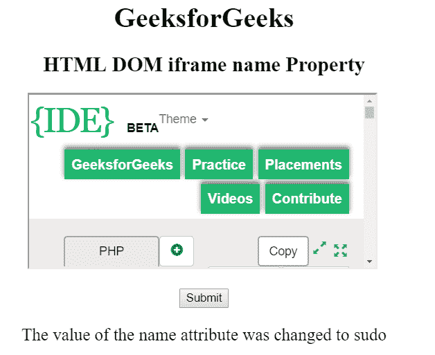

# HTML | DOM IFrame 名称属性

> 原文:[https://www . geesforgeks . org/html-DOM-iframe-name-property/](https://www.geeksforgeeks.org/html-dom-iframe-name-property/)

**HTML DOM IFrame 名称属性**用于设置或返回 IFrame 元素的名称属性的值。名称属性在 JavaScript 中用作元素的引用。

**语法:**

*   它返回名称属性。

    ```html
    iframeObject.name
    ```

*   它用于设置 name 属性。

    ```html
    iframeObject.name = name
    ```

**属性值:**

*   **名称:**用于指定 Iframe 元素的名称。

**返回值:**它返回一个指定 Iframe 元素名称的字符串值。

**示例 1:** 本示例说明如何返回 Iframe 名称属性。

```html
<!DOCTYPE html> 
<html> 

<head> 
    <title> 
        HTML DOM iframe name property 
    </title> 
</head> 

<body style="text-align:center;"> 

    <h1>GeeksforGeeks</h1> 

    <h2>HTML DOM iframe name Property</h2> 

    <iframe src="https://ide.geeksforgeeks.org/index.php"
        id="GFG" height="200" width="400" name="myGeeks">
    </iframe> 

    <br><br>

    <button onclick="Geeks()">Submit</button>

    <p id="sudo" style="font-size:20px"></p>         

    <script>
        function Geeks() {
            var doc_id = document.getElementById("GFG").name;
            document.getElementById("sudo").innerHTML = doc_id;
        }
    </script>
</body> 

</html>
```

**输出:**
**点击按钮前:**

**点击按钮后:**


**示例 2:** 本示例说明如何设置 Iframe name 属性。

```html
<!DOCTYPE html> 
<html> 

<head> 
    <title> 
        HTML DOM iframe name property 
    </title> 
</head> 

<body style="text-align:center;"> 

    <h1>GeeksforGeeks</h1> 

    <h2>HTML DOM iframe name Property</h2> 

    <iframe src="https://ide.geeksforgeeks.org/index.php"
        id="GFG" height="200" width="400" name="myGeeks">
    </iframe> 

    <br><br>

    <button onclick="Geeks()">Submit</button>

    <p id="sudo" style="font-size:20px"></p>         

    <script>
        function Geeks() {
            var doc_id = document.getElementById("GFG").name
                        = "sudo";
            document.getElementById("sudo").innerHTML = 
                        "The value of the name attribute was"
                        + " changed to " + doc_id;
        }
    </script>
</body> 

</html>
```

**输出:**
**点击按钮前:**

**点击按钮后:**


**支持的浏览器:**HTML DOM IFrame name 属性支持的浏览器如下:

*   谷歌 Chrome
*   微软公司出品的 web 浏览器
*   火狐浏览器
*   旅行队
*   歌剧