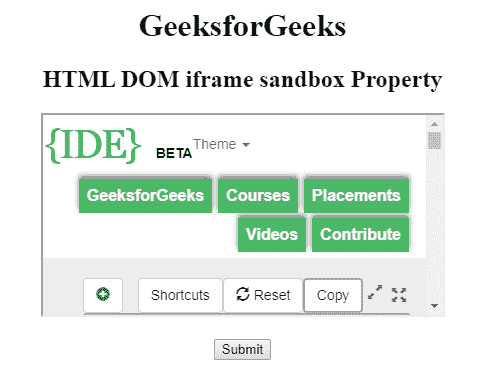
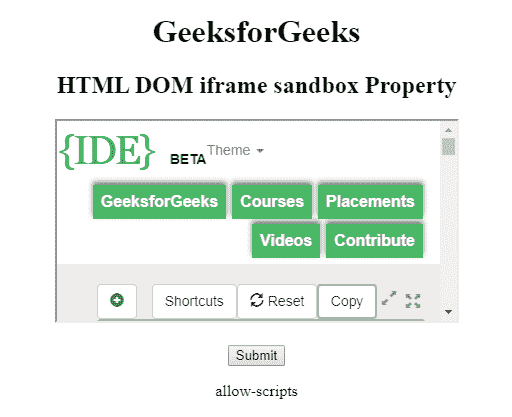

# HTML | DOM IFrame 沙盒属性

> 原文:[https://www . geesforgeks . org/html-DOM-iframe-sandbox-property/](https://www.geeksforgeeks.org/html-dom-iframe-sandbox-property/)

HTML DOM 中的 **IFrame 沙盒属性**用于返回 IFrame 元素中沙盒属性的值。

当沙箱属性存在时，它将:

*   将内容视为来自单一来源
*   它阻止表单提交
*   它会阻止脚本执行
*   它禁用了 API
*   它还防止链接瞄准其他浏览上下文
*   它停止内容以导航其顶级浏览上下文
*   阻止自动触发的功能(例如自动播放视频或自动聚焦表单控件)

沙盒属性的值要么是简单的沙盒(然后应用所有限制)，要么是一个用空格分隔的预定义值列表，它将带走实际的限制。

**语法:**

```html
iframeObject.sandbox
```

**返回值:**返回代表沙箱属性值的字符串值。

**示例:**

```html
<!DOCTYPE html>
<html>

<head>
    <title>
        HTML DOM iframe sandbox Property
    </title>
</head>

<body style="text-align:center;">

    <h1>GeeksforGeeks</h1>

    <h2> 
        HTML DOM iframe sandbox Property 
    </h2>

    <iframe src="https://ide.geeksforgeeks.org/index.php"
            id="GFG" 
            height="200"
            width="400" 
            sandbox="allow-scripts">
    </iframe>

    <br>
    <br>

    <button onclick="Geeks()">
        Submit
    </button>
    <p id="sudo"></p>
    <script>
        function Geeks() {
            var iframeID = document.getElementById("GFG").sandbox;
            document.getElementById("sudo").innerHTML = iframeID;
        }
    </script>
</body>

</html>
```

**Output:**

*   Before Clicking on Button:

    

    *   After Clicking on Button:

    

    **支持的浏览器:****HTML DOM IFrame 沙盒属性**支持的浏览器如下:

    *   谷歌 Chrome 4.0
    *   Internet Explorer 10.0
    *   Firefox 17.0
    *   苹果 Safari 5.0
    *   Opera 15.0