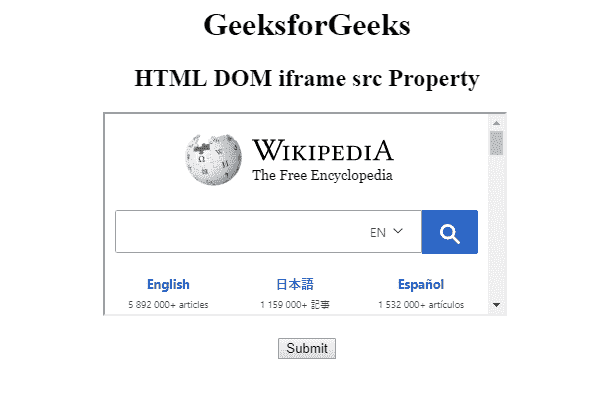

# HTML | DOM IFrame src 属性

> 原文:[https://www.geeksforgeeks.org/html-dom-iframe-src-property/](https://www.geeksforgeeks.org/html-dom-iframe-src-property/)

**HTML DOM IFrame src 属性**用于设置或返回 **< iframe >元素**的 src 属性的值。此属性用于指定嵌入 iframe 元素的文档的 URL。
**语法:**

*   它返回 src 属性。

```html
iframeObject.src
```

*   用于设置 src 属性。

```html
iframeObject.src = URL 
```

**属性值:**
它包含单值网址，指定嵌入 iframe 的文档的网址。网址链接有两种类型，如下所示:

*   **绝对 URL:** 指向另一个网页。
*   **相对 URL:** 指向同一网页的其他文件。

**返回值:**它返回一个字符串值，该值代表嵌入在 Iframe 元素中的文档的网址。
**示例 1:** 本示例说明如何返回 Iframe src 属性。

## 超文本标记语言

```html
<!DOCTYPE html>
<html>

<head>
    <title>
        HTML DOM iframe src Property
    </title>
</head>

<body style="text-align:center;">

    <h1>GeeksforGeeks</h1>

    <h2>
      HTML DOM iframe src Property
  </h2>

    <iframe src=
"https://ide.geeksforgeeks.org/index.php"
            id="GFG"
            height="200"
            width="400">
  </iframe>
    <br>
    <br>
    <button onclick="Geeks()">Submit</button>
    <p id="sudo"></p>

    <script>
        function Geeks() {
            var x = document.getElementById("GFG").src;
            document.getElementById("sudo").innerHTML = x;

        }
    </script>

</body>

</html>
```

**输出:**
**点击按钮前:**


**点击按钮后:**


**示例 2:** 本示例说明如何设置 Iframe src 属性。

## 超文本标记语言

```html
<!DOCTYPE html>
<html>

<head>
    <title>
        HTML DOM iframe src Property
    </title>
</head>

<body style="text-align:center;">

    <h1>GeeksforGeeks</h1>

    <h2>
      HTML DOM iframe src Property
  </h2>

    <iframe src=
"https://ide.geeksforgeeks.org/index.php"
            id="GFG"
            height="200"
            width="400">
  </iframe>
    <br>
    <br>
    <button onclick="Geeks()">Submit</button>
    <p id="sudo"></p>

    <script>
        function Geeks() {
            var x =
                document.getElementById("GFG").src =
                "https://www.wikipedia.org/";

        }
    </script>

</body>

</html>
```

**输出:**
**点击按钮前:**


**点击按钮后:**



**支持的浏览器:****HTML DOM IFrame src Property**支持的浏览器如下:

*   谷歌 Chrome
*   微软公司出品的 web 浏览器
*   火狐浏览器
*   苹果 Safari
*   歌剧