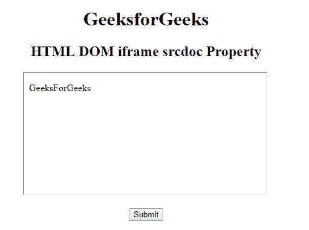
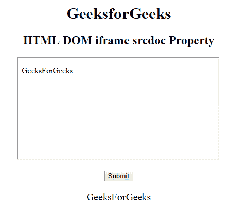
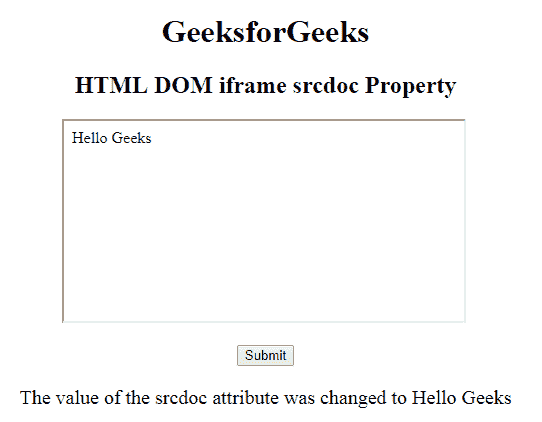

# HTML | DOM IFrame srcdoc 属性

> 原文:[https://www . geesforgeks . org/html-DOM-iframe-srcdoc-property/](https://www.geeksforgeeks.org/html-dom-iframe-srcdoc-property/)

**HTML DOM IFrame srcdoc 属性**用于设置或返回< Iframe >元素的 srcdoc 属性的值。 **srcdoc** 属性用于在< Iframe >元素中指定文档的 HTML 内容。它可以与沙箱和无缝属性一起使用。

**语法:**

*   它返回 srcdoc 属性。

```html
iframeObject.srcdoc
```

*   它用于设置 srcdoc 属性。

```html
iframeObject.srcdoc = HTML_code
```

**属性值:**

*   **HTML_code:** 用于指定将在一个 Iframe 元素中显示的页面的 HTML 内容。

**返回值:**它返回一个字符串值，该值指定在 Iframe 元素中显示的页面的 HTML 内容。

**示例 1:** 此示例说明如何返回 Iframe srcdoc 属性。

## 超文本标记语言

```html
<!DOCTYPE html>
<html>

<head>
    <title>
        HTML DOM iframe srcdoc Property
    </title>
</head>

<body style="text-align:center;">

    <h1>GeeksforGeeks</h1>

    <h2>HTML DOM iframe srcdoc Property</h2>

    <iframe src="https://ide.geeksforgeeks.org/index.php"
            srcdoc="
<p>GeeksForGeeks</p>
" id="GFG"
            height="200" width="400" name="myGeeks">
    </iframe>

    <br><br>

    <button onclick="Geeks()">Submit</button>

    <p id="sudo" style="font-size:20px"></p>

    <script>
        function Geeks() {
            var x = document.getElementById("GFG").srcdoc;
            document.getElementById("sudo").innerHTML = x;
        }
    </script>
</body>

</html>
```

**输出:**

*   **点击按钮前:**



*   **点击按钮后:**



**示例 2:** 本示例说明如何设置 Iframe srcdoc 属性。

## 超文本标记语言

```html
<!DOCTYPE html>
<html>

<head>
    <title>
        HTML DOM iframe srcdoc Property
    </title>
</head>

<body style="text-align:center;">

    <h1>GeeksforGeeks</h1>

    <h2>HTML DOM iframe srcdoc Property</h2>

    <iframe src="https://ide.geeksforgeeks.org/index.php"
            srcdoc="
<p>GeeksForGeeks</p>
" id="GFG"
            height="200" width="400" name="myGeeks">
    </iframe>

    <br><br>

    <button onclick="Geeks()">Submit</button>

    <p id="sudo" style="font-size:20px"></p>

    <script>
        function Geeks() {
            var x = document.getElementById("GFG").srcdoc
                    = "Hello Geeks";
            document.getElementById("sudo").innerHTML
                    = "The value of the srcdoc attribute "
                    + "was changed to " + x;
        }
    </script>
</body>

</html>
```

**输出:**

*   **点击按钮前:**


*   **点击按钮后:**



**支持的浏览器:**HTML DOM IFrame srcdoc Property 支持的浏览器如下:

*   谷歌 Chrome 20.0
*   Firefox 25.0
*   Safari 6.0
*   Opera 15.0