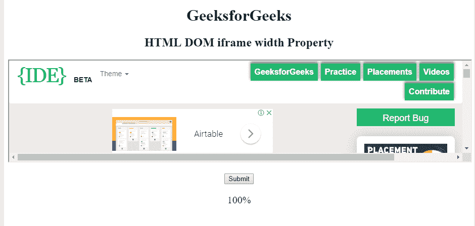

# HTML | DOM IFrame 宽度属性

> 原文:[https://www . geesforgeks . org/html-DOM-iframe-width-property/](https://www.geeksforgeeks.org/html-dom-iframe-width-property/)

**HTML DOM IFrame 宽度属性**用于设置或返回 IFrame 元素的宽度属性值。**宽度属性**用于指定 Iframe 元素的宽度。

**语法:**

*   它返回宽度属性。

    ```html
    iframeObject.width
    ```

*   它用于设置 width 属性。

    ```html
    iframeObject.width = pixels
    ```

**属性值:**

*   **像素:**以像素为单位指定 Iframe 元素的宽度。

**返回值**返回一个字符串值，以像素为单位表示 Iframe 的宽度。

**示例 1:** 本示例说明如何返回 Iframe 宽度属性。

```html
<!DOCTYPE html>
<html>

<head>
    <title>
        HTML DOM iframe width Property
    </title>
</head>

<body style="text-align:center;">

    <h1>GeeksforGeeks</h1>

    <h2>HTML DOM iframe width Property</h2>

    <iframe src=
"https://ide.geeksforgeeks.org/index.php" 
            id="GFG" 
            height="200" 
            width="400">
  </iframe>
    <br>
    <br>
    <button onclick="Geeks()">Submit</button>
    <p id="sudo" style="font-size:20px"></p>
    <script>
        function Geeks() {
            var x = 
                document.getElementById("GFG").width;
            document.getElementById("sudo").innerHTML = x;

        }
    </script>

</body>

</html>
```

**输出:**
**点击按钮前:**


**点击按钮后:**


**示例-2 :** 本示例说明如何设置 Iframe 宽度属性。

```html
<!DOCTYPE html>
<html>

<head>
    <title>
        HTML DOM iframe width Property
    </title>
</head>

<body style="text-align:center;">

    <h1>GeeksforGeeks</h1>

    <h2>HTML DOM iframe width Property</h2>

    <iframe src=
"https://ide.geeksforgeeks.org/index.php" 
            id="GFG"
            height="200" 
            width="400">
  </iframe>
    <br>
    <br>
    <button onclick="Geeks()">Submit</button>
    <p id="sudo" style="font-size:20px"></p>
    <script>
        function Geeks() {
            var x =
                document.getElementById("GFG").width = 
                "100%";
            document.getElementById("sudo").innerHTML = x;

        }
    </script>

</body>

</html>
```

**输出:**

**点击按钮前:**


**点击按钮后:**


**支持的浏览器:****HTML DOM IFrame width Property**支持的浏览器如下:

*   谷歌 Chrome
*   微软公司出品的 web 浏览器
*   火狐浏览器
*   苹果 Safari
*   歌剧