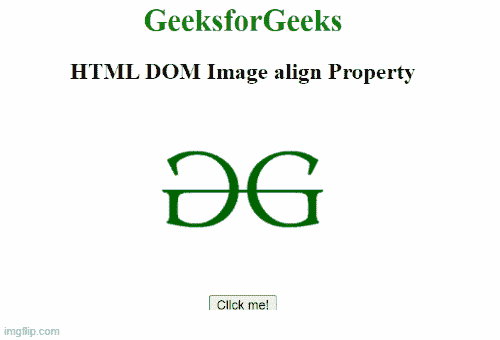
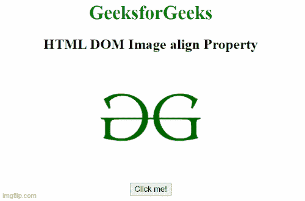

# HTML DOM 图像对齐属性

> 原文:[https://www . geesforgeks . org/html-DOM-image-align-property/](https://www.geeksforgeeks.org/html-dom-image-align-property/)

**HTML DOM 图像对齐属性**用于设置或返回图像元素的 [**【对齐】**](https://www.geeksforgeeks.org/html-align-attribute/) 属性的值。

**语法:**

它返回图像对齐属性。

```html
Imageobject.align;
```

它设置图像对齐属性。

```html
Imageobject.align="left|right|middle|top|bottom"
```

**属性值:**

*   **左:**将图像设置为左对齐。
*   **右**:将图像设置为右对齐。
*   **中间:**将图像设置为中间。
*   **顶部:**它将图像设置为顶部对齐。
*   **底部:**它将图像设置为底部对齐。

**返回值:**返回一个字符串值，代表图像元素的对齐方式。

**示例 1:** 本示例返回图像对齐属性。

## 超文本标记语言

```html
<!DOCTYPE html>
<html>

<body>
    <center>
        <h1 style="color: green">
            GeeksforGeeks
        </h1>

        <h2>HTML DOM Image align Property</h2>

        
        <br>
        <button onclick="Geeks()">
            Click me!
        </button>

        <p id="sudo"></p>

    </center>

    <script>
        function Geeks() {
            var g = document.getElementById("GFG").align;
            document.getElementById("sudo").innerHTML = g;
        }
    </script>
</body>

</html>
```

**输出:**



**示例 2:** 下面的代码返回图像对齐属性。

## 超文本标记语言

```html
<!DOCTYPE html>
<html>

<body>
    <center>
        <h1 style="color: green">
            GeeksforGeeks
        </h1>

        <h2>HTML DOM Image align Property</h2>

        
        <br>

        <button onclick="Geeks()">Click me!</button>

        <p id="sudo"></p>

    </center>

    <script>
        function Geeks() {
            var g = document.getElementById("GFG").align = "left";
            document.getElementById("sudo").innerHTML = g;
        }
    </script>
</body>

</html>
```

**输出:**



**支持的浏览器:**

*   谷歌 Chrome
*   微软公司出品的 web 浏览器
*   歌剧
*   火狐浏览器
*   苹果 Safari