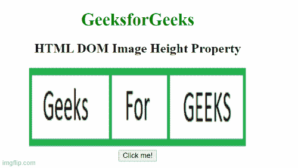

# HTML DOM 图像高度属性

> 原文:[https://www . geesforgeks . org/html-DOM-image-height-property/](https://www.geeksforgeeks.org/html-dom-image-height-property/)

**HTML DOM 图像高度属性**用于设置或返回图像元素的高度属性值。[**高度**](https://www.geeksforgeeks.org/html-height-attribute/) 属性用于以像素为单位指定图像的高度。

**语法:**

它返回图像高度属性。

```html
imageObject.height
```

它设置图像高度属性。

```html
imageObject.height = pixels
```

**属性值:**

*   **像素:**以像素为单位指定图像元素的高度

**返回值:**返回一个字符串值，以像素为单位表示图像的高度。

**示例 1:** 本示例说明如何返回图像高度属性。

## 超文本标记语言

```html
<!DOCTYPE html>
<html>

<body>
    <center>
        <h1 style="color: green">
            GeeksforGeeks
        </h1>

        <h2>HTML DOM Image Height Property</h2>

        
        <br>

        <button onclick="Geeks()">
            Click me!
        </button>

        <p id="sudo"></p>

    </center>

    <script>
        function Geeks() {
            var g = document.getElementById("GFG").height;

            document.getElementById("sudo")
                    .innerHTML = g + "px";
        }
    </script>
</body>

</html>
```

**输出:**



**示例 2:** 下面的代码设置图像高度属性。

## 超文本标记语言

```html
<!DOCTYPE html>
<html>

<body>
    <center>
        <h1 style="color: green">
            GeeksforGeeks
        </h1>

        <h2>HTML DOM Image Height Property</h2>

        
        <br>

        <button onclick="Geeks()">
            Click me!
        </button>

        <p id="sudo"></p>

    </center>

    <script>
        function Geeks() {
            var g = document.getElementById(
                    "GFG").height = "75";

            document.getElementById("sudo")
                    .innerHTML = g + "px";
        }
    </script>
</body>

</html>
```

**输出:**


**支持的浏览器:**

*   谷歌 Chrome
*   火狐浏览器
*   微软公司出品的 web 浏览器
*   苹果 Safari
*   歌剧