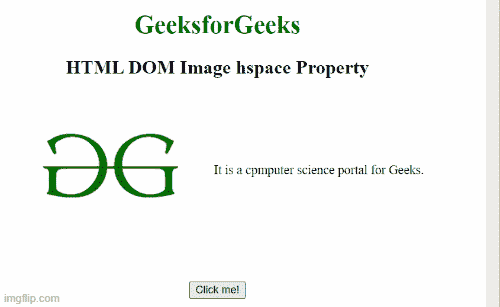

# HTML DOM 图像空间属性

> 原文:[https://www . geesforgeks . org/html-DOM-image-hs pace-property/](https://www.geeksforgeeks.org/html-dom-image-hspace-property/)

**HTML DOM Image hs space 属性**用于设置或返回图像元素的**hs space**属性的值。**空间属性**用于指定图像左侧和右侧的空白区域数量。

**语法:**

它设置图像空间属性。

```html
Imageobject.hspace="pixels";
```

它返回图像空间属性。

```html
Imageobject.hspace;
```

**属性值:**它包含指定图像左侧和右侧空格数量的值，即**像素**。

**示例 1:** 下面的代码示例返回图像空间属性。

## 超文本标记语言

```html
<!DOCTYPE html>
<html>

<body>
    <center>
        <h1 style="color: green">GeeksforGeeks</h1>
        <h2>HTML DOM Image hspace Property</h2>

<p> 
            It is a computer science portal for Geeks.
        </p>

        <br>
        <button onclick="Geeks()">Click me!</button>
        <p id="sudo"></p>

    </center>

    <script>
        function Geeks() {
            var g = document.getElementById("GFG").hspace;
            document.getElementById("sudo").innerHTML = g + "px";
        }
    </script>
</body>

</html>
```

**输出:**



**示例 2:** 在此示例中，代码设置了 Image hspace 属性。

## 超文本标记语言

```html
<!DOCTYPE html>
<html>

<body>
    <center>
        <h1 style="color: green">GeeksforGeeks</h1>
        <h2>HTML DOM Image hspace Property</h2>

<p> 
            It is a computer science portal for Geeks.
        </p>

        <br>
        <button onclick="Geeks()">Click me!</button>
        <p id="sudo"></p>

    </center>

    <script>
        function Geeks() {
            var g = document.getElementById("GFG").hspace;
            document.getElementById("sudo").innerHTML = g + "px";
        }
    </script>
</body>

</html>
```

**输出:**

