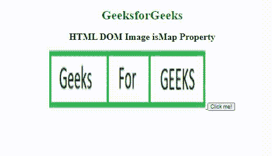
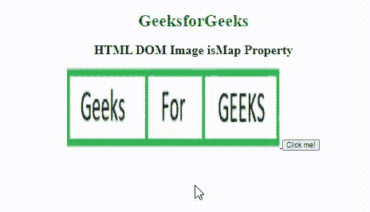

# HTML DOM 图片 isMap 属性

> 原文:[https://www . geesforgeks . org/html-DOM-image-ismap-property/](https://www.geeksforgeeks.org/html-dom-image-ismap-property/)

**HTML DOM Image isMap 属性**用于设置或返回图像是否是服务器端图像映射的组成部分。图像地图是带有可点击区域的图片。当单击服务器端图像地图时，印刷机坐标平方度量作为网址查询字符串发送到服务器。

**语法**

*   它用于返回 isMap 属性。

    ```html
    .imageObject.isMap
    ```

*   它用于设置 isMap 属性。

    ```html
    imageObject.isMap = true|false
    ```

**属性值:**它包含一个布尔值，该值定义图像是否是服务器端图像映射的一个组件。

*   **true:** 它定义图像是服务器端图像映射的一部分。
*   **false:** 定义图像不是服务器端图像映射的一部分。

**返回值:**返回一个布尔值，该值表示图像是否是服务器端图像映射的组成部分。

**示例 1:** 下面的代码返回 isMap 属性。

## 超文本标记语言

```html
<!DOCTYPE html>
<html>
  <body>
    <center>
      <h1 style="color: green">GeeksforGeeks</h1>
      <h2>HTML DOM Image isMap Property</h2>
      <a href="#">
        
      </a>
      <button onclick="Geeks()">Click me!</button>
      <p id="sudo"></p>
    </center>

    <script>
      function Geeks() {
        var g = document.getElementById("GFG").isMap;
        document.getElementById("sudo").innerHTML = g;
      }
    </script>
  </body>
</html>
```

**输出**



**示例 2:** 下面的代码将 isMap 属性设置为 false。

## 超文本标记语言

```html
<!DOCTYPE html>
<html>
  <body>
    <center>
      <h1 style="color: green">GeeksforGeeks</h1>
      <h2>HTML DOM Image isMap Property</h2>
      <a href="#">
        
      </a>
      <button onclick="Geeks()">Click me!</button>
      <p id="sudo"></p>
    </center>

    <script>
      function Geeks() {
        var g = (document.getElementById("GFG").isMap = false);
        document.getElementById("sudo").innerHTML =
          "Now the ismap attribute is set to:" + g;
      }
    </script>
  </body>
</html>
```

**输出:**



**支持的浏览器**

*   谷歌 Chrome
*   微软公司出品的 web 浏览器
*   歌剧
*   旅行队
*   火狐浏览器