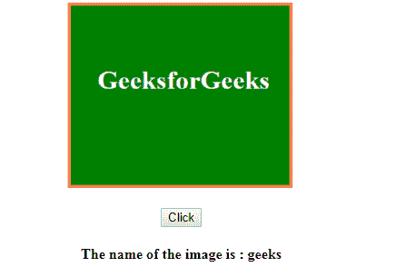
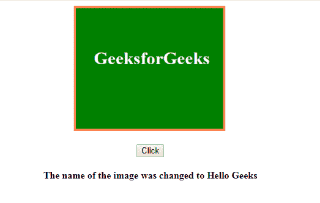

# HTML | DOM 图像名称属性

> 原文:[https://www.geeksforgeeks.org/html-dom-image-name-property/](https://www.geeksforgeeks.org/html-dom-image-name-property/)

HTML DOM 中的**图像名称属性**用于设置或返回<图像>元素的名称属性的值。

**语法:**

```html
imageObject.name
```

**属性值:**

*   **名称:**指定图像的名称。

**返回值:**返回代表图像名称的字符串值。

**示例-1:** 本示例返回图像名称属性。

```html
<html>

<body>
    <center>

        
        <br>
        <br>
        <button type="button" onclick="getHeight()">
          Click
      </button>
        <h4 id="text"></h4>
    </center>
    <script>
        function getHeight() {
            var imgObject = 
                document.getElementById("image");
            var output = 
                document.getElementById("text");
            output.innerHTML = "The name of the image is : "
            + imgObject.name;
        }
    </script>
</body>

</html>
```

**点击按钮前:**

**点击按钮后:**


**示例-2:** 本示例设置图像名称属性。

```html
<html>

<body>
    <center>

        
        <br>
        <br>
        <button type="button" onclick="getHeight()">
          Click
      </button>
        <h4 id="text"></h4>
    </center>
    <script>
        function getHeight() {
            var imgObject = 
                document.getElementById(
                  "image").name = "Hello Geeks";

            var output = 
                document.getElementById(
                  "text").innerHTML = 
                "The name of the image was changed to " 
            + imgObject;
        }
    </script>
</body>

</html>
```

**点击按钮前:**

**点击按钮后:**


**支持的浏览器:****DOM 图像名称属性**支持的浏览器如下:

*   谷歌 Chrome
*   微软公司出品的 web 浏览器
*   火狐浏览器
*   苹果 Safari
*   歌剧