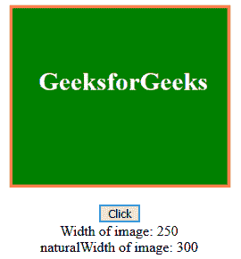

# HTML | DOM 图像自然宽度属性

> 原文:[https://www . geesforgeks . org/html-DOM-image-natural width-property/](https://www.geeksforgeeks.org/html-dom-image-naturalwidth-property/)

**naturalWidth :** 属性用于获取图像的原始宽度。由于要在网页上显示的图像的宽度可以使用< img >标签的“宽度”属性来修改，因此在需要图像的原始宽度而不是定制宽度的情况下，自然宽度属性变得有用。它是只读属性。

**语法:**

```html
*imageObject*.naturalWidth
```

**返回值:**以像素为单位返回图像的原始宽度。

**示例:**

## 超文本标记语言

```html
<html>

<body>
    
    <br>
    <br>
    <button type="button" onclick="getWidth()">Click</button>
    <div id="text"></div>
    <script>
        function getWidth() {
            var imgObject = document.getElementById("image");
            var output = document.getElementById("text");
            output.innerHTML = "Width of image: " + imgObject.width +
            "<br>naturalWidth of image: " + imgObject.naturalWidth;
        }
    </script>
</body>

</html>
```

**输出:**
点击前:


点击后:



*   谷歌 Chrome
*   Internet Explorer 9.0 或更高版本
*   Mozilla Firefox
*   旅行队
*   歌剧