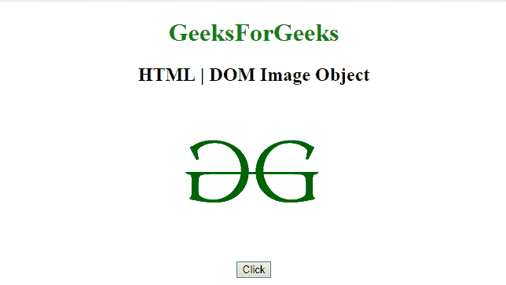

# HTML | DOM 图像对象

> 原文:[https://www.geeksforgeeks.org/html-dom-image-object/](https://www.geeksforgeeks.org/html-dom-image-object/)

HTML DOM 中的**图像对象**用来表示 HTML [<图像>](https://www.geeksforgeeks.org/html-images/) 元素。
此标签用于**设置**或**获取<图像>元素的**属性。使用 **getElementById()** 方法可以访问该元素。

**语法:**

```html
document.getElementById("Image_ID");

```

该图像标识被分配给 HTML < image >元素。

**示例-1:**

```html
<!DOCTYPE html>
<html>

<head>
    <base id="Geek_Base"
          href="https://www.geeksforgeeks.org">

    <title>
        HTML | DOM Image Object
    </title>
</head>

<body style="text-align:center;">

    <h1 style="color:green;">  
            GeeksForGeeks  
        </h1>

    <h2>HTML | DOM Image Object</h2>

    <button onclick="myGeeks()">
        Click
    </button>
    <h4><p id="Geek_p" 
           style="color:green">
      </p></h4>

    <script>
        function myGeeks() {

            //   Creating IMG object.
            var x = document.createElement("IMG");

            x.setAttribute("src", 
"https://media.geeksforgeeks.org/wp-content/uploads/gfg-39.png");

            x.setAttribute("width", "304");
            x.setAttribute("height", "228");
            x.setAttribute("alt", "GFG_Logo");
            document.body.appendChild(x);
        }
    </script>
</body>

</html>
```

**输出**

*   **之前点击按钮:**
    
*   **After click on the button:**
    

    >

    **示例-2:**

    ```html
    <!DOCTYPE html>
    <html>

    <head>
        <base id="Geek_Base"
              href="https://www.geeksforgeeks.org">
        <title>
            HTML | DOM Image Object
        </title>
    </head>

    <body style="text-align:center;">

        <h1 style="color:green;">  
                GeeksForGeeks  
            </h1>

        <h2>HTML | DOM Image Object</h2>
        
        <br>

        <button align="center" onclick="myGeeks()">
            Click
        </button>
        <h4><p id="Geek_p" style="color:green"></p></h4>

        <script>
            function myGeeks() {

                //  Accessing image element.
                var x = 
                document.getElementById("myImg").src;

                document.getElementById(
                  "Geek_p").innerHTML = x;
            }
        </script>
    </body>

    </html>
    ```

    **输出**

    *   **Before click on the button:**
        

        **点击按钮后:**
        

    **示例-3:**

    ```html
    <!DOCTYPE html>
    <html>

    <head>
        <base id="Geek_Base" 
              href="https://www.geeksforgeeks.org">
        <title>
            HTML | DOM Image Object
        </title>
    </head>

    <body style="text-align:center;">

        <h1 style="color:green;">  
                GeeksForGeeks  
            </h1>

        <h2>HTML | DOM Image Object</h2>
        
        <br>
        <button align="center" onclick="myGeeks()">
            Click
        </button>
        <h4><p id="Geek_p" style="color:green"></p></h4>

        <script>
            function myGeeks() {

                //  Return Image width.
                var x = document.getElementById(
                  "myImg").width;

                document.getElementById(
                  "Geek_p").innerHTML = x;
            }
        </script>
    </body>

    </html>
    ```

    **输出**

    *   **之前点击按钮:**
        
    *   **点击按钮后:**
        

    **支持的浏览器:**

    *   谷歌 Chrome
    *   Mozilla Firefox
    *   边缘
    *   旅行队
    *   歌剧